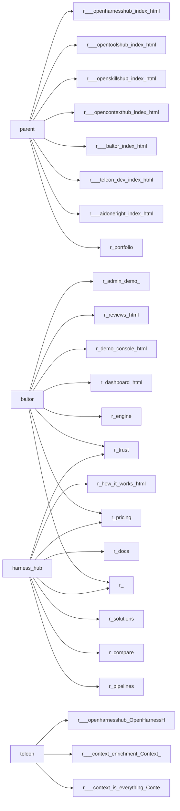

# UI/UX audit — 2026-06-10T13:21:47.393Z

Design system: **Hanken Grotesk** (display) + **IBM Plex Mono** (mono) · min text 12px · min tap 44px.
**9 surfaces · 17 findings** (high 0, medium 10, low 7)

## Findings to troubleshoot (ranked)
- **[medium] baltor** · tiny-text: 44 text elements < 12px (e.g. "Conflicts solved" 10px)
- **[medium] teleon** · off-system-font: off-design-system fonts: jetbrains mono
- **[medium] teleon** · tiny-text: 15 text elements < 12px (e.g. "▾" 9px)
- **[medium] harness-hub** · off-system-font: off-design-system fonts: space grotesk, times new roman
- **[medium] harness-hub** · tiny-text: 3 text elements < 12px (e.g. "▴Activity" 10px)
- **[medium] control-tower** · tiny-text: 20 text elements < 12px (e.g. "active" 11px)
- **[medium] hub:opencontexthub** · off-system-font: off-design-system fonts: times new roman
- **[medium] hub:openreviewhub** · off-system-font: off-design-system fonts: times new roman
- **[medium] hub:openroutinghub** · off-system-font: off-design-system fonts: times new roman
- **[medium] hub:openharnesshub** · off-system-font: off-design-system fonts: times new roman
- **[low] parent** · small-tap-target: 7 interactive elements < 44px (e.g. "AI Done Right" 16px)
- **[low] baltor** · small-tap-target: 13 interactive elements < 44px (e.g. "Baltor" 23px)
- **[low] teleon** · font-sprawl: 4 distinct font families (expect ≤3)
- **[low] teleon** · small-tap-target: 12 interactive elements < 44px (e.g. "⬢
▾" 32px)
- **[low] harness-hub** · font-sprawl: 4 distinct font families (expect ≤3)
- **[low] harness-hub** · small-tap-target: 25 interactive elements < 44px (e.g. "Explore" 32px)
- **[low] control-tower** · small-tap-target: 25 interactive elements < 44px (e.g. "local" 17px)

## Per-surface metrics
| surface | fonts | taps<44 | tiny text | overflow |
|---|---|---|---|---|
| parent | 2 | 7 | 0 | no |
| baltor | 3 | 13 | 44 | no |
| teleon | 4 | 12 | 15 | no |
| harness-hub | 4 | 25 | 3 | no |
| control-tower | 2 | 25 | 20 | no |
| hub:opencontexthub | 1 | 0 | 0 | no |
| hub:openreviewhub | 1 | 0 | 0 | no |
| hub:openroutinghub | 1 | 0 | 0 | no |
| hub:openharnesshub | 1 | 0 | 0 | no |

## UI/UX action graph (surface → nav targets)
