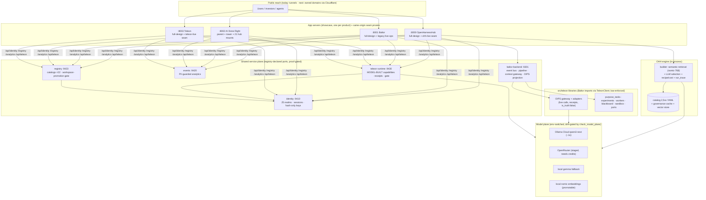

# Architecture · SWOT · Problem→Solution · Hosting — the full review

Date 2026-06-11 (owner-requested). Companion to `docs/status/products-deep-dive.md` (dependency
detail) and `docs/strategy/teleon-baltor-openharnesshub-portfolio.md` (the canonical law).
Everything below reflects the LIVE, verified state — not aspiration.

## 1. Architecture — how everything works (one diagram)

Provisioning flows: **customer** — per-realm sign-up → console `/keys` (shown-once, hash-only);
**owner** — `AIDR_REGISTRY_ADMINS` roster seam + (queued) `provision_access` CLI; **agents** —
minted API keys against the same realms (verify endpoint exists).

## 2. SWOT + product-market fit — PER SERVICE (each unit stands alone)

### 2.1 Baltor CEaaS — verified context serving (paid core)
- **S**: only demoable verification RAIL (live checks, receipts, held-out warnings, revocation);
  real pipeline + real inference receipts on film. **W**: tenant isolation unproven; live feeds
  limited (eCFR real, OFAC/EUR-Lex fixtures); billing emulated. **O**: compliance buyers must
  prove currency (the OFAC-staleness demo IS the wedge); Airbyte educates the category then
  stops at movement. **T**: Anthropic FS / data-gravity platforms bundling "good enough".
- **PMF**: target = compliance/risk teams shipping agent workflows in regulated facts.
  Problem urgency HIGH (provability is mandated, not nice-to-have). Evidence today: working
  sanctions/CFPB proof loop; zero external users. **Verdict: strongest fit hypothesis in the
  portfolio — unproven.** Falsify next: 3 design-partner conversations off the guided demos.

### 2.2 Baltor Context Gateway + MCP — the agent context door
- **S**: bounded packs + source handles + deferred fetch (anti-overfetch by design); MCP bridge
  exists. **W**: ctx:// handles fixture-grade; not cloud-exposed. **O**: MCP adoption wave
  (Airbyte ads literally target "mcp_door"). **T**: every platform shipping an MCP server.
- **PMF**: target = agent builders needing governed context without trusting raw stores.
  Urgency MEDIUM rising. **Verdict: fit follows CEaaS** (same buyer, second door). Falsify:
  one external agent consuming the gateway end-to-end.

### 2.3 Teleon Capability Runtime — model-built, evidence-gated capabilities (paid core)
- **S**: the thesis runs on film (model builds → gate judges → self-refine → receipts per
  attempt); restart-safe; 12s cloud runs. **W**: 4 seed capabilities; tower designed; metering
  not billing. **O**: CodeStrap proves "underwritable AI" budgets exist; we underwrite with
  EVIDENCE not just state machines. **T**: durable-execution platforms adding eval layers.
- **PMF**: target = platform/AI-infra teams burned by agent regressions. Urgency MEDIUM-HIGH.
  Evidence: lifecycle real; no external capability authored yet. **Verdict: strong narrative
  fit, thin usage evidence.** Falsify: let one external team author a capability + criteria.

### 2.4 Teleon Agent Capability Gateway — agents as customers
- **S**: deterministic-first token ladder; per-realm keys agents can mint/verify; receipts.
  **W**: not exposed beyond local; no SDK. **O**: agent-to-agent commerce is forming; few
  receipt-backed capability vendors. **T**: tool marketplaces (MCP directories) as default.
- **PMF**: target = autonomous agents/fleets needing stable capabilities cheaper than
  re-derivation. Urgency LOW today, compounding. **Verdict: earliest-stage bet; keep cheap.**
  Falsify: one external agent calling a capability via key, unattended.

### 2.5 OpenHarnessHub Builder — describe → build → RUN → export (free funnel)
- **S**: fully live funnel (semantic retrieval over 2,5xx, LLM selection, REAL run trace,
  open-spec export); zero-signup preview. **W**: lift "unproven" (no measured evals); cold
  builds ~30-40s on the 80B route. **O**: the demo that makes the registry legible; agents can
  consume the same API. **T**: copilot-style builders inside incumbent platforms.
- **PMF**: funnel, not revenue — fit = does it convert visitors to accounts/exports. Evidence:
  conversion loop works on film; no traffic. **Verdict: fit-for-purpose as funnel.** Falsify:
  put traffic on it; measure preview→signup.

### 2.6 OpenHarnessHub Registry + promotion plane (+ 21-hub network)
- **S**: review→promotion gate with separation of duties (proof-gated); 22 seeded catalogs;
  one engine renders all hubs; per-hub realms live. **W**: no community; signing (Rekor) not
  yet real; bench hubs private by design. **O**: trust-graded component distribution is unowned
  territory (HF/MCP dirs are unverified listings). **T**: incumbent registries adding badges.
- **PMF**: target = component publishers/consumers needing trust grades. Urgency LOW until
  builder traffic exists. **Verdict: infrastructure ahead of demand — correct sequencing.**
  Falsify: 10 external submissions through the review queue.

### 2.7 Identity & Keys plane (shared enabler)
- **S**: 25 isolated realms, hash-only keys, audited, restart-safe; one kit. **W**: no OAuth;
  demo-grade store. **O**: per-product realms = clean per-product GTM. **T**: none material
  (internal). **PMF: enabler — fit measured by zero-friction sign-ups across all surfaces
  (achieved on film).** Not sellable; don't productize.

### 2.8 OIPS Inference Gateway (shared; future sellable)
- **S**: numeric provider graph + adapters + receipts with is_truth:false; live calls now.
  **W**: per-node secrets not yet config; one style live. **O**: "model receipts" as a
  compliance artifact. **T**: LiteLLM/router incumbents (without receipts). **PMF: enabler
  now; sellable only after Teleon/Baltor prove receipt demand.**

### 2.9 Events/analytics plane (enabler)
- PII-guarded ingest live across surfaces. **PMF: enabler; fit = funnel metrics exist when
  traffic arrives.** Not sellable.

### Portfolio-level (kept for context)
**Portfolio**
- **S**: evidence-gated honesty is implemented, not claimed (receipts, promotion gates, held-out
  warnings, "unproven" states); one design system across 28 surfaces; provider-neutral model
  plane (cloud↔local is a 3-line .env change); 390+ proof checks; everything filmed.
- **W**: single-operator bus factor; demo-grade persistence (JSONL/PVC, Postgres path unproven
  under load); lift numbers still "unproven" (eval harness not yet measuring real tasks);
  designed surfaces remain (billing, Teleon tower); no paying users yet.
- **O**: Airbyte just educated the market that "context layer for agents" matters — we sell the
  layer ABOVE theirs (assurance); CodeStrap validates determinism-as-product; regulated-facts
  beachhead (sanctions/CFPB demos already real); agents-as-customers (keys/receipts built).
- **T**: Airbyte's distribution could absorb "good enough" context; data-gravity platforms
  (Snowflake/Databricks/DeepMind-Contextual) bundling; LLM vendors shipping built-in
  verification; our words ("context layer", "underwrite") being claimed in others' ads.

**Baltor** — S: only player with a verification RAIL + lossless held-out honesty; live pipeline
+ receipts demoable today. W: guided demos are fixtures (labeled); tenant isolation unproven.
O: compliance buyers need provable currency (OFAC staleness demo IS the pitch). T: Anthropic
financial-services + Airbyte context store eating the "good enough" end.

**Teleon** — S: model-builds, evidence-judges, self-refines — on film; receipts per attempt;
agent gateway + key plane real. W: tower/portal designed; deep runtime (PurposeTask TS build)
pending. O: CodeStrap/X-Reason proves enterprises buy "AI you can underwrite" — we underwrite
with EVIDENCE, not just state machines. T: Temporal/DBOS adding eval-ish layers.

**OpenHarnessHub** — S: 2,5xx-component live registry + describe→build→RUN funnel fully real;
21-hub network effect surface; open spec (CTS). W: lift "unproven" until evals run; community
=0 today. O: the open funnel feeding both products; agents installing components by API.
T: HuggingFace/MCP directories as default discovery.

## 3. Problem → Solution (per paid package / surface / tool)

| Offering | Problem (real) | Our solution (live today) | Gap to close |
|---|---|---|---|
| **Baltor CEaaS** (paid) | Agents act on stale/conflicting/unprovable facts | Verified+Current+Provable serving: pipeline w/ verification rail, receipts, held-out warnings, revocation | tenant isolation proof; live feeds beyond eCFR; pricing page → real billing |
| **Baltor Context Gateway / MCP** | Agents over-fetch and trust raw context | Bounded packs + source handles + deferred fetch; glossary/dimensions/rerank | ctx:// handle consistency; cloud MCP exposure |
| **Teleon runtime** (paid) | Agent capability quality is vibes, not evidence | Model-built capabilities gated by REAL example suites; receipts/version/rollback | TS control tower; broader capability templates; metering→billing |
| **Teleon agent gateway** | Agents burn tokens re-deriving stable capabilities | Deterministic-first token ladder; receipt-backed calls; per-realm keys | publish as cloud endpoint + SDK |
| **OHH builder** (free funnel) | Pipeline assembly is artisanal | describe→build (LLM-selected, semantically retrieved)→run (REAL trace)→export (open spec) | measured lift on cards; community publish flow promo |
| **OHH registry + 21 hubs** | Component trust is unverifiable | Promotion gate, review queue, provenance fields from catalog, signed-* roadmap | real signing (Rekor) per BACKEND-STACK; bench hubs flip-to-live criteria |
| **Identity/keys plane** | Per-product auth sprawl | One kit, 25 isolated realms, shown-once hash-only keys, audited | OAuth seams (owner-gated) when real users arrive |
| **Inference gateway (OIPS)** | Provider lock-in + unprovable model usage | Numeric provider graph, adapters, receipts w/ is_truth:false | per-node secrets (api_key_env) + cloud nodes config |

## 4. Competitors (matrix is memory-backed; details in memory files)

| Player | Their claim | Our counter |
|---|---|---|
| **Airbyte** | "Context layer for AI agents" (Context Store, MCP, 600+ connectors) | They MOVE context; we make it SAFE TO ACT ON (verify/reconcile/gate/receipt). Wrap them as ingestion candidate. |
| **CodeStrap X-Reason** | Underwritable orchestration (NL→XState) | They orchestrate work; we govern claims + evidence-gate capability itself. Adapter candidate. |
| Supermemory / memory players | Agent memory | Memory ≠ assurance; wrap behind ports. |
| Snowflake/Databricks/DeepMind-Contextual | Data-gravity context | Neutral overlay + receipts portability is the counter. |
| Temporal/DBOS | Durable execution | Runtime substrate candidates, never the trust plane. |

Positioning actions queued: Baltor pages adopt assurance-vs-movement contrast (owner copy
approval required — design contract).

## 5. Modularization review (honest)

**Genuinely modular:** the two model resolvers (every consumer shares them); OIPS adapter
registry (one base class, styles by config); realm-parameterized services (25 realms, zero
per-realm code); the seam-proxy table (registry-driven ports); makeHub (21 sites from one
engine); the port-script PATCHES discipline (all divergence recorded + drift-gated); per-app
kit copies byte-checked against one source.
**Watch items:** `baltor_admin_demo_server.py` is a 5.7k-line monolith (handlers are extracted,
the dispatcher isn't) — split when it next grows; ohh-live/teleon-live duplicate the
honest-fallback boilerplate (fine at 2, extract at 3); legacy + full-design coexistence doubles
some surfaces (intentional, lossless — revisit after launch); events-service self-test port
collision (needs --port arg).

## 6. Outdated context corrected in this review

- "Design rollout to web/ still queued" → DONE (4 apps live on the full design) — memory updated.
- Scout claims fixed earlier (hash embeddings active / seams missing) — see deep-dive addenda.
- `web/README` says no-build "vanilla" in places — superseded by the transplant section (kept).
- OpenRouter "ready" → key VALID but ZERO CREDITS (owner action).

## 7. Hosting — the ADVERSARIAL pass (revised after deeper diligence)

> **SUPERSEDED IN PART (2026-06-11):** the full six-lane comparison — Fly deep-dive, managed
> scale-to-zero (ACA/Cloud Run), VPS/k3s, PaaS, bare-metal/budget, and the per-provider
> MCP/agent-automation scores demanded by the owner's new hard requirement ("agent sets up
> everything after account+billing") — now lives in `docs/strategy/hosting-decision-matrix.md`.
> That doc is the current verdict (Fly ~$40–50 leaning pick · DO DOKS boring-safe · ACA dark
> horse); this section remains as the earlier adversarial narrative for DO/Hetzner/Fly.

Need: ~10 lightweight long-running Python services + 4 fronts + Postgres + Redis, ALL
same-region/same-network, US presence, cheap, ONE provider. GPU not required.

**Hetzner — does it have US?** YES: **Ashburn, VA + Hillsboro, OR — CLOUD ONLY** (no dedicated/
auction servers in the US); ARM CAX available in Ashburn; US prices slightly above EU
(CX22 ≈ $4.59, CAX11 ≈ $3.79; June-2026 price update pending). **Adversarial findings:** a real
pattern of NEW-account KYC flags and sudden suspensions ("high-risk" closures without
explanation), **no managed Postgres/Redis at all**, **no SLA on cloud**, thin support. Cheapest
by far, but for an investor-facing deployment a fresh US account is an onboarding risk and
everything is self-operated.

**Fly.io — validated, with scar tissue.** Strengths confirmed: true same-region private
networking (6PN), plentiful US regions, machines from ~$2, great DX, our shape fits. Adversarial
findings: a steady incident cadence in their own infra-log (SJC switch drop, FRA WireGuard
gateway, secrets-service emergency maintenance, Consul wedge affecting Managed Postgres) and the
historical 3-day Postgres outage; **Managed Postgres pricing cliffs ($282 → $962 → ~$2k/mo
tiers)** with provisioned-storage billing; volume snapshots become billable Jan 2026; volumes
are single-host. Verdict: fine IF we self-run small Postgres/Redis on volumes and accept the
incident cadence — never their Managed Postgres at our stage.

**DigitalOcean — the adversarial control nobody asked for.** Managed Postgres+Redis from ~$15,
droplets $6–24, US regions, boring-reliable track record, same-VPC co-location. ~60% pricier
than Hetzner, far below Fly's managed-DB cliffs.

| Option | US? | Co-location | Realistic $/mo | Ops burden | Key risk |
|---|---|---|---|---|---|
| **DigitalOcean** droplet(s)+managed PG/Redis | ✅ | same VPC/region | **$40–65** | LOW | none notable — boring is the feature |
| **Hetzner Ashburn** 1 box + k3s, self-run PG/Redis | ✅ (cloud only) | same HOST | **$9–16** | MEDIUM | new-account KYC/suspension; no SLA; self-ops |
| **Fly.io** machines + volumes, self-run PG | ✅ | 6PN same region | **$15–35** | LOW-MED | incident cadence; storage billing; avoid MPG |
| Render | ✅ | private net | $70+ | LOW | cost at our service count |
| Hyperscalers | ✅ | same region | most | HIGH | overkill pre-traffic |

**Revised verdict (risk-adjusted for the YC window):**
1. **DigitalOcean** if the deployment must never embarrass us in front of an investor —
   one region, managed data stores, ~$50/mo, lowest variance.
2. **Hetzner Ashburn** if cost rules and we accept self-ops + verify the account EARLY
   (order now, run something harmless for two weeks before relying on it).
3. **Fly.io** if zero-server-admin matters most — self-run small Postgres, skip MPG.
All three sit behind the same Cloudflare tunnel/DNS plan; our k3s/systemd manifests work on
any of them. Owner picks the risk posture; everything after the API token is on me.

## 8. Owner decisions requested

1. Hosting pick (Hetzner-k3s recommended) + Cloudflare token + NS flips.
2. OpenRouter credits (optional speed).
3. Copy approval for the Airbyte-contrast positioning lines.
4. Which lift-eval harness tasks to measure first (turns "unproven" into numbers).
