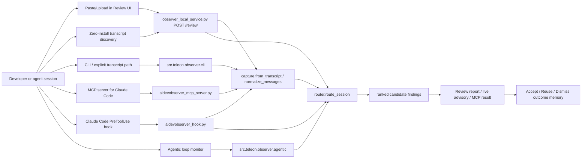
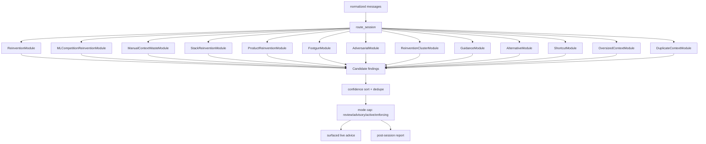
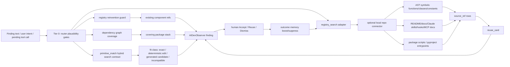
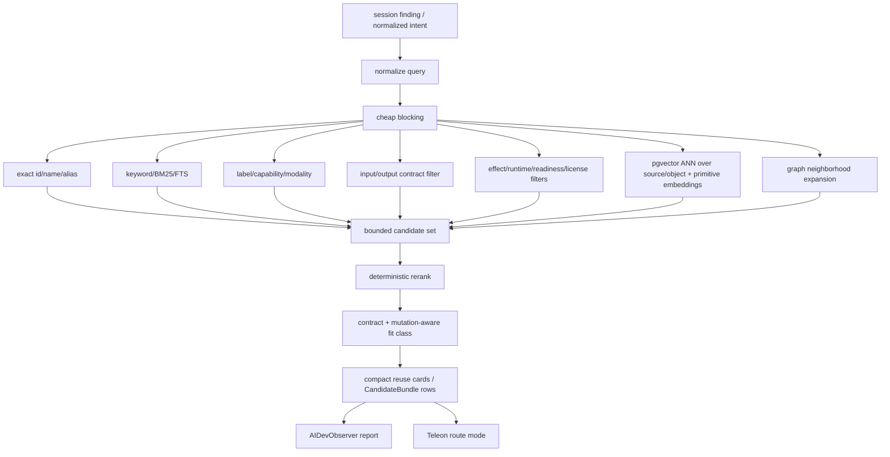

# AIDevObserver Trigger And Primitive Search Architecture

Updated: 2026-06-29

This note explains how AIDevObserver currently receives session triggers, how it searches for reusable objects/primitives, where vector search/pgvector fits, and why some magic numbers still exist in the code.

Implementation note: observer hot-path knobs now route through `_repos/teleon/backend/src/teleon/observer/settings.py`, and review findings/reports carry transparent estimated savings fields:

```json
{
  "savings": {
    "tokens_avoided_estimate": 10000,
    "model_calls_avoided_estimate": 3,
    "basis": "heuristic_registry_reuse_route",
    "serves_truth": false
  }
}
```

These are planning/reporting estimates, not billing receipts. Findings and summary rollups keep `serves_truth=false`.

## Current Trigger Flow

AIDevObserver has one review engine with several trigger surfaces. The important invariant is that every output is candidate advice only: `serves_truth=false` until a later proof/promotion path exists.



### Trigger Surfaces

| Surface | File | Current behavior |
|---|---|---|
| Review UI / HTTP | `_repos/shared-backend-components/scripts/observer_local_service.py` | `POST /review` accepts `{messages}` or `{transcript_path}` and returns ranked findings. |
| Live hook | `_repos/shared-backend-components/scripts/aidevobserver_hook.py` | Claude Code `PreToolUse` hook. It synthesizes the pending tool call into one message and surfaces non-blocking advice only for that pending call. |
| MCP server | `_repos/shared-backend-components/scripts/aidevobserver_mcp_server.py` | Exposes `list_sessions`, `review_session`, and `live_review` over stdio JSON-RPC/MCP. |
| Session capture | `_repos/teleon/backend/src/teleon/observer/capture.py` | Normalizes Claude/Codex JSONL-style transcripts into event messages. |
| Agentic monitor | `_repos/teleon/backend/src/teleon/observer/agentic.py` | Detects loop, stall, repeated failure, budget overrun, and goal drift in autonomous runs. |
| Local outcome memory | `_repos/teleon/backend/src/teleon/observer/session_store.py` | Stores metadata-only accept/reuse/dismiss outcomes and tunes later source-ref ranking. |

## Current Review Engine

The router is the common engine. Post-session review is just `route_session(..., mode="review_only")`; live coaching is the same router with a live mode and an interruption budget.



Current grounding sources include:

- deterministic behavioral heuristics in `_repos/shared-backend-components/architecture/behavioral_heuristics.json`;
- the Teleon registry reinvention guard in `_repos/teleon/backend/src/teleon/registry/reinvention_guard.py`;
- dependency-stack coverage via `_repos/teleon/backend/src/teleon/knowledge/dependency_graph.py`;
- deterministic lexical product-distance matching;
- hand-authored route maps for early Kaggle/data-science examples;
- optional local repo search through `_repos/teleon/backend/src/teleon/observer/registry_search.py`, backed first by `_repos/teleon/backend/src/teleon/observer/local_registry_connector.py`.

## Primitive Search Flow

There are two related search paths today:

1. AIDevObserver session review search: local, deterministic, and source-ref oriented.
2. Teleon/OpenHub primitive search: hybrid search contract, vector-ready rows, and pgvector-ready storage path.



### Shared Registry Search Adapter

`_repos/teleon/backend/src/teleon/observer/registry_search.py` is now the shared seam for review enrichment and direct registry search. It owns:

- local-registry opt-in behavior (`OH_OBSERVER_EXPOSE_LOCAL_REGISTRY`);
- report enrichment with source refs and reuse cards;
- one local repo index pass per enriched report;
- input/output edge-aware search when the caller supplies requested contracts;
- deterministic edge mutation reporting (`scalar_to_sequence`, `output_field_wrapper`, `field_rename_adapter`, retry/cache/rate-limit policy);
- outcome-memory boost/suppress ranking;
- metadata-only source-ref keys for Accept / Reuse / Dismiss;
- service-shaped `/registry/search` payloads.

The HTTP service, CLI review path, and MCP `review_session` tool all route through this adapter when registry enrichment is requested. That keeps search behavior out of the web-service layer and gives future pgvector/global primitive search one place to plug in.

### Local Repo Connector

The local connector indexes an explicit repo root and returns candidate source refs. It never returns absolute local paths and never claims truth.

It currently extracts:

- Python functions, methods, classes, and uppercase constants from AST;
- contracts from annotations when available;
- README/docs snippets;
- Claude-style `CLAUDE.md`, `skills/SKILL.md`, `commands/*.md`, `hooks/*.md`, and `mcp/*.md` docs;
- `package.json` scripts and `pyproject.toml` entrypoints.

Each hit can become a compact `reuse_card`:

```json
{
  "kind": "reuse_card",
  "primitive_id": "prim:candidate:local-repo:...",
  "contract": {"input": "PythonCallArgs", "output": "PythonReturnValue"},
  "input_edge": {"contract": "PythonCallArgs", "shape": "object"},
  "output_edge": {"contract": "PythonReturnValue", "shape": "scalar"},
  "edge_fit": {
    "fit_class": "deterministic_edit_match",
    "required_mutations": ["scalar_to_sequence"]
  },
  "edge_mutation_options": [
    {
      "id": "scalar_to_sequence",
      "deterministic": true,
      "proof_obligations": ["singleton_equivalence", "order_preserved", "error_mapping_preserved"]
    }
  ],
  "blackbox": {
    "does": "Read CSV rows with header handling.",
    "input_edge": {"contract": "path:str", "shape": "scalar"},
    "output_edge": {"contract": "list[dict[str,str]]", "shape": "sequence"},
    "mutation_options": ["..."]
  },
  "effects": [],
  "readiness": "R3_contract_known",
  "trust": "candidate",
  "candidate": true,
  "serves_truth": false
}
```

That card is intentionally enough for an LLM or developer to understand the edge without reading all source.

Search is now edge-aware when requested contracts are supplied. The ranking order is:

1. exact text/source match;
2. exact input/output edge compatibility;
3. deterministic edge mutation compatibility;
4. query-only mutation hints, such as batch/list language mapping to `scalar_to_sequence`;
5. lexical fallback and outcome-memory ranking.

This is still candidate evidence. A deterministic mutation option is permission to build a `VariationRecord` later, not a claim that the variation already serves truth.

Efficiency note: `_repos/teleon/backend/src/teleon/observer/local_registry_connector.py` now exposes `cached_index_local_repo(...)`. Local search uses a bounded, TTL-governed in-process cache, and report enrichment indexes the repo once before searching per finding. This avoids the previous worst case where a report with several findings could re-walk and re-parse the same repo several times.

## Is AIDevObserver Using pgvector Today?

Short answer: not as the live AIDevObserver hot path yet.

The repo has real pgvector infrastructure:

- `db/postgres/schema.sql` enables `CREATE EXTENSION IF NOT EXISTS vector` and defines `object_embedding embedding vector(384)`.
- `db/vector/spec.md` declares catalog, knowledge, source/object, and entity indexes.
- `_repos/shared-backend-components/scripts/db/vector_config_registry.py` exports canonical vector settings from `_repos/shared-backend-components/scripts/_config.py`.
- `_repos/shared-backend-components/scripts/db/build_vector_store.py` builds a local vector store with hash fallback or real embedding backend.
- `_repos/shared-backend-components/scripts/db/pgvector_embedding_load_plan.py` emits reviewable SQL to load vector rows into Postgres/pgvector.
- `_repos/shared-backend-components/scripts/primitive_source_lifecycle.py` emits `primitive_vector_export.jsonl`.

But current AIDevObserver review/search behavior is still mostly:

- deterministic router modules;
- deterministic lexical matching;
- local repo source-ref search;
- outcome-memory boost/suppress;
- primitive lifecycle vector rows as staging artifacts.

The current primitive lifecycle vector rows are explicitly marked:

```text
embedding_model: deterministic-lexical-hash-v1
embedding_status: staging_not_promotion_ready
serves_truth: false
```

So the accurate launch-readiness statement is:

```text
AIDevObserver has pgvector-ready architecture and exports, but the live review endpoint is not yet backed by a production pgvector hybrid index. The next integration step is to make /registry/search call a hybrid retrieval service backed by Postgres/pgvector plus exact filters, not only the local lexical connector.
```

## Target Search Architecture

The target for large-scale primitive search is hybrid retrieval, not pure vector search.



Search should produce these fit classes:

- `exact_match`
- `deterministic_edit_match`
- `nondeterministic_edit_match`
- `incompatible`

Vector similarity should only help retrieve candidates. It must not override incompatible contracts, effects, policy, readiness, or proof state.

## How Massive Primitive Database Search Should Work

For a large primitive database, the intended flow should be:

1. Normalize session text into capability intent, object type, contract hints, and domain.
2. Apply exact blocking first: ids, aliases, function names, package/tool names, route templates.
3. Apply lexical/FTS search next: names, descriptions, tags, source docs, proof labels.
4. Apply pgvector ANN search over primitive/search-card/source-object embeddings.
5. Filter by hard facts: input/output contract, effect policy, runtime, license, privacy, readiness.
6. Use graph neighborhood evidence: known chains, prior accepted reuse, dependency-stack coverage.
7. Classify fit: direct, deterministic remix, generated adapter candidate, incompatible.
8. Return compact cards, not full code.
9. Record human Accept/Reuse/Dismiss as ranking memory.
10. Promote only through proof/promotion, never by search alone.

## Why Magic Numbers Still Exist

The repo has a no-magic-values rule in `docs/codex/no-magic-values.md`, and many shared values are already centralized in `_repos/shared-backend-components/scripts/_config.py`. However, AIDevObserver still has local alpha-era thresholds and limits in the hot path.

The main reasons:

1. **Observer started as an alpha product slice.** Thresholds were initially placed near the logic for fast iteration.
2. **Some literals were named constants but not governed settings.** Examples: live budget, confidence floors, token approximations, local search limits. A named constant is better than an inline number, but it is not yet a centralized product setting.
3. **Some values are protocol constants.** JSON-RPC/MCP error codes and protocol versions are literals by nature, but should still be named and documented.
4. **Some values are test fixtures.** Self-tests intentionally include sample counts or expected values; those are lower risk but should be clearly fixture-local.
5. **The primitive/vector stack has been moving quickly.** Recent work centralized vector dimensions/model IDs, but observer-specific thresholds have not all been moved into the same settings registry.

Examples that should be centralized next:
Status: the primary observer runtime knobs for router scoring, capture truncation, hook context, local registry search, service body/search limits, session-store truncation, and token-savings estimates are now centralized in `_repos/teleon/backend/src/teleon/observer/settings.py`. Remaining numeric literals should be treated as protocol constants, UI/demo fixture values, self-test fixtures, or follow-up cleanup targets.

| Current area | Example values | Why centralize |
|---|---:|---|
| Live router | live interruption budget, confidence floors, token thresholds | Centralized in observer settings. |
| Capture | tool-input head size and tool-result cap multiplier | Centralized in observer settings. |
| Local registry connector | indexed file cap, doc chars, snippet chars, score weights | Centralized in observer settings. |
| Observer service | max body size, review hit limits, outcome-memory window | Centralized in observer settings. |
| Token savings | reuse/context/shortcut savings estimates | Centralized in observer settings. |
| Agentic monitor | loop/stall/failure/drift thresholds | Still env-overridable in `agentic.py`; move to settings profile next. |
| Registry matching | semantic bucket count, blocked rerank cap, score weights | Still in registry matching layer; move to registry/search settings next. |

## Recommended Cleanup Plan

Create an AIDevObserver settings registry that reads from one source and can later map to hosted `setting_profile` rows:

```text
_repos/teleon/backend/src/teleon/observer/settings.py
  ObserverRouterSettings
  ObserverCaptureSettings
  ObserverLocalRegistrySettings
  ObserverServiceSettings
  ObserverAgenticSettings
  ObserverSearchSettings
```

Then migrate in this order:

1. Move router thresholds from `router.py` into observer settings.
2. Move local-registry limits and score weights from `local_registry_connector.py`.
3. Move service request/search/outcome limits from `observer_local_service.py`.
4. Move capture truncation values from `capture.py`.
5. Keep protocol constants where they are, but tag them as protocol-owned.
6. Add a small checker that flags new numeric literals in observer hot-path files unless they are imported settings, protocol codes, or self-test fixtures.

## Launch-Relevant Gap

For launch, the most important missing integration is not the existence of pgvector. It is connecting the loop end-to-end:

```text
session trigger
  -> finding
  -> hybrid primitive search
  -> compact reuse card with input/output/effects
  -> developer accepts/reuses
  -> outcome memory improves ranking
  -> high-confidence repeated reuse creates Teleon route/proof candidate
```

The code has most pieces separately. The product-grade step is to make the primitive database search service the default source behind AIDevObserver findings, with local repo search as one source among many.
