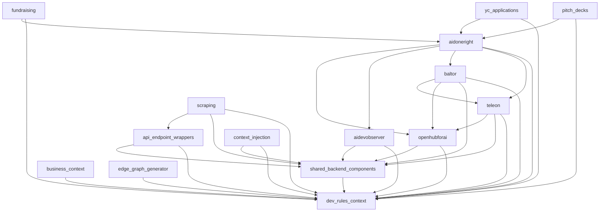

# Repo-to-repo dependency graph

15 surfaces, 32 dependency edges. Direction: `A --> B`
means A may consume B's published interface.

## Adjacency (who each repo may consume)
- **aidevobserver** → dev-rules-context, shared-backend-components
- **aidoneright** → aidevobserver, baltor, dev-rules-context, openhubforai, teleon
- **api-endpoint-wrappers** → dev-rules-context, shared-backend-components
- **baltor** → dev-rules-context, openhubforai, shared-backend-components, teleon
- **business-context** → dev-rules-context
- **context-injection** → dev-rules-context, shared-backend-components
- **dev-rules-context** → (none)
- **edge-graph-generator** → dev-rules-context
- **fundraising** → aidoneright, dev-rules-context
- **openhubforai** → dev-rules-context, shared-backend-components
- **pitch-decks** → aidoneright, dev-rules-context
- **scraping** → api-endpoint-wrappers, dev-rules-context, shared-backend-components
- **shared-backend-components** → dev-rules-context
- **teleon** → dev-rules-context, openhubforai, shared-backend-components
- **yc-applications** → aidoneright, dev-rules-context
