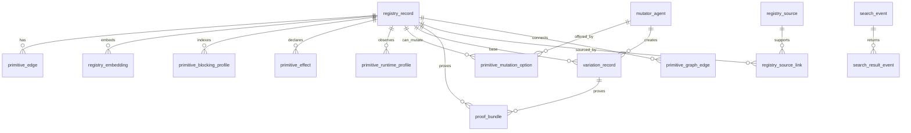

# Primitive Registry Operational Schema

Updated: 2026-06-29

This note defines the operational schema for storing registry primitives,
embeddings, blocking keys, input/output edges, mutation affordances, mutator
agents, resource observations, search events, and proof/promotion state.

It complements the existing generic catalog schema in `db/postgres/schema.sql`,
the vector contract in `db/vector/spec.md`, the hybrid search contract in
`architecture/primitive_hybrid_search_contracts.json`, and the variation
contract in `architecture/teleon_primitive_variation_contracts.json`.

## Current State

The repository now has both the broad catalog substrate and the primitive
hot-path schema:

- `component`, `component_candidate`, `source_record`, `normalized_object`,
  `object_embedding`, `index_record`, `label_assignment`, `dimension_value`,
  `promotion_decision`, and context-object tables in `db/postgres/schema.sql`.
- A generic pgvector-ready `object_embedding` table and vector index profiles
  in `db/vector/spec.md` and `scripts/db/vector_config_registry.py`.
- Primitive operational tables and views in `db/postgres/schema.sql`:
  `registry_record`, `primitive_edge`, `primitive_blocking_key`,
  `mutator_agent`, `variation_record`, `primitive_search_view`,
  `edge_compatible_view`, and `aidevobserver_reuse_view`.
- A primitive search contract that requires exact, keyword, label, semantic,
  input-contract, output-contract, graph-neighborhood, blocking-index,
  deterministic-mutation, and nondeterministic-mutation lanes.
- A variation contract that requires every mutation to create a durable
  variation record with `serves_truth=false` until proof/promotion.
- An in-code deterministic matcher in `_repos/teleon/backend/src/teleon/registry/primitive_match.py`
  that already computes blocking profiles, request blocking keys, fit classes,
  required mutations, and adapter plans.
- `scripts/primitive_registry_builder.py` now emits operational JSONL row
  families under `operational/` for registry records, I/O edges, effects,
  embeddings, blocking profiles, blocking keys, mutator agents, mutation
  options, source records, and source links.
- `scripts/primitive_quality_promoter.py` reads the broad candidate corpus,
  performs deterministic AST contract enrichment where possible, scores
  blackbox clarity and practical reuse domains, and emits the default
  AIDevObserver-safe suggestion surface under `quality/`.
- `scripts/db/primitive_registry_operational_load_plan.py` converts those row
  families into table-shaped CSV plus an idempotent `psql` load script.
- The load path has been smoke-proven in a disposable pgvector container:
  canonical schema load, generated CSV load, and row counts all pass for
  records, edges, blocking keys, mutators, mutation options, and embeddings.

The next missing piece is runtime adoption: local registry connectors,
AIDevObserver findings, Teleon primitive search, runtime observations, search
events, reuse outcomes, proof bundles, and promotion records should read/write
these operational rows as the hot path.

## Design Rule

Use the generic catalog tables for public component manifests and broad
OpenHubForAI objects. Use the primitive operational tables below for hot-path
registry search, AIDevObserver reuse findings, Teleon graph assembly, mutation
planning, resource-aware routing, and proof/promotion.

The invariant remains:

```text
search result = candidate evidence
mutation option = candidate evidence
variation record = candidate evidence
PlanLock = execution truth
ledger/proof/promotion = served truth boundary
```

The quality gate adds a second invariant:

```text
broad real-code candidate != default developer recommendation
```

The builder may emit thousands of R3 symbol-level candidates. AIDevObserver
defaults to the smaller `R8_aidevobserver_surfaceable` set generated by the
quality promoter. Lower-readiness rows stay indexed for fallback search,
contract enrichment, proof runs, and future promotion.

## Entity Model



## Core Tables

### `registry_record`

One canonical row per primitive, template, composite, tool, media operation,
workflow, adapter, or candidate route.

Important columns:

```sql
registry_record_id      text primary key
tenant_id               text not null
kind                    text not null
slug                    text not null
version                 text not null
status                  text not null
trust_status            text not null
readiness_level         text not null
serves_truth            boolean not null default false
title                   text not null
blackbox_description    text not null
canonical_json          jsonb not null
record_hash             text not null
source_license          text
privacy_boundary        text
created_at              timestamptz not null
updated_at              timestamptz not null
```

Recommended constraints:

- unique `(tenant_id, kind, slug, version)`
- `serves_truth=true` only after proof/promotion
- `status` should distinguish `candidate`, `review`, `promoted`,
  `deprecated`, `held`, and `rejected`

### `primitive_edge`

Stores input and output contracts as first-class graph edges.

```sql
primitive_edge_id       text primary key
registry_record_id      text not null references registry_record(registry_record_id)
edge_role               text not null -- input, output, state_read, state_write, artifact, secret_ref
edge_name               text not null
contract_uid            text
contract_notation       text not null
shape                   text not null
field_keys              jsonb not null default '[]'::jsonb
schema_json             jsonb not null default '{}'::jsonb
artifact_policy         jsonb not null default '{}'::jsonb
secret_policy           jsonb not null default '{}'::jsonb
edge_hash               text not null
```

Hot indexes:

- `(registry_record_id, edge_role)`
- `(edge_role, shape)`
- GIN on `field_keys`
- hash/equality on `edge_hash`

This table is the answer to: "Can output edge A feed input edge B?"

### `primitive_graph_edge`

Stores known composition edges between primitives.

```sql
primitive_graph_edge_id text primary key
from_record_id          text not null references registry_record(registry_record_id)
from_edge_id            text references primitive_edge(primitive_edge_id)
to_record_id            text not null references registry_record(registry_record_id)
to_edge_id              text references primitive_edge(primitive_edge_id)
edge_kind               text not null -- maps_output_to_input, validates, emits, wraps, replaces
fit_class               text not null -- exact_match, deterministic_edit_match, nondeterministic_edit_match
required_mutations      jsonb not null default '[]'::jsonb
proof_status            text not null
serves_truth            boolean not null default false
```

Use this for known-good chains, negative memory, and route reuse.

### `primitive_effect`

Queryable effect declarations.

```sql
primitive_effect_id     text primary key
registry_record_id      text not null references registry_record(registry_record_id)
effect_kind             text not null -- pure, net.read, db.write, fs.read, fs.write, model.call, browser.run
effect_scope            jsonb not null default '{}'::jsonb
requires_gate           boolean not null default false
requires_receipt        boolean not null default false
idempotency_required    boolean not null default false
```

This lets the compiler reject side effects before gates and require
idempotency/compensation for writes.

### `registry_embedding`

Embeddings by subject and view profile. The vector dimension should be
generated from the canonical vector config, not hand-copied.

```sql
registry_embedding_id   text primary key
registry_record_id      text not null references registry_record(registry_record_id)
view_profile            text not null -- alias, signature, planning, evidence, debug, canonical
embedding_model_id      text not null
text_hash               text not null
embedded_text           text not null
object_embedding_id     text references object_embedding(embedding_id)
embedding               vector(<DEFAULT_EMBEDDING_DIMENSIONS>)
created_at              timestamptz not null
```

Indexes:

- unique `(registry_record_id, view_profile, embedding_model_id, text_hash)`
- ANN index on `embedding`
- btree `(embedding_model_id, view_profile)`

The actual SQL type must be rendered from `scripts._config` /
`scripts.db.vector_config_registry`, not duplicated as a magic number.

### `primitive_blocking_profile`

Precomputed cheap search profile for every registry row.

```sql
blocking_profile_id     text primary key
registry_record_id      text not null references registry_record(registry_record_id)
exact_keys              jsonb not null default '[]'::jsonb
keyword_keys            jsonb not null default '[]'::jsonb
label_keys              jsonb not null default '[]'::jsonb
input_signature         jsonb not null default '{}'::jsonb
output_signature        jsonb not null default '{}'::jsonb
graph_signature         jsonb not null default '[]'::jsonb
semantic_text_hash      text not null
semantic_bucket_keys    jsonb not null default '[]'::jsonb
mutation_hints          jsonb not null default '[]'::jsonb
profile_hash            text not null
serves_truth            boolean not null default false
```

Use this to shrink millions of rows before vector/rerank.

### `primitive_blocking_key`

Flattened inverted-index keys.

```sql
blocking_key_id         text primary key
registry_record_id      text not null references registry_record(registry_record_id)
lane                    text not null -- exact, keyword, label, input_field, output_field, graph, mutation, semantic_bucket
key                     text not null
weight                  double precision
profile_hash            text not null
```

Indexes:

- `(tenant_id, lane, key)` if denormalized with tenant
- `(lane, key)`
- `(registry_record_id)`

This is the main fast-recall lane for AIDevObserver and Teleon.

## Mutation Tables

### `mutator_agent`

Stores deterministic and nondeterministic mutators as first-class agents/tools.

```sql
mutator_agent_id        text primary key
tenant_id               text not null
kind                    text not null -- deterministic, nondeterministic
short_code              text not null -- map, field, wrap, retry, cache, generated_adapter
name                    text not null
from_shape              text not null
to_shape                text not null
preconditions           jsonb not null default '[]'::jsonb
effect_delta            jsonb not null default '{}'::jsonb
memory_delta            jsonb not null default '{}'::jsonb
cache_delta             jsonb not null default '{}'::jsonb
runtime_delta           jsonb not null default '{}'::jsonb
proof_obligations       jsonb not null default '[]'::jsonb
auto_apply_policy       text not null
implementation_ref      jsonb not null default '{}'::jsonb
serves_truth            boolean not null default false
```

Deterministic mutators can be compiler-applied. Nondeterministic mutators can
only generate candidate edits.

### `primitive_mutation_option`

Precomputed mutation options for a primitive.

```sql
mutation_option_id      text primary key
registry_record_id      text not null references registry_record(registry_record_id)
mutator_agent_id        text not null references mutator_agent(mutator_agent_id)
from_edge_id            text references primitive_edge(primitive_edge_id)
target_edge_template    jsonb not null default '{}'::jsonb
fit_class               text not null
precondition_status     text not null -- satisfied, possible, blocked, unknown
confidence              double precision
reason                  text
serves_truth            boolean not null default false
```

This lets search say "this does not match directly, but it can match through
`scalar_to_sequence`" without asking an LLM to read or rewrite source.

### `primitive_quality_assessment`

Deterministic quality assessment for every broad primitive candidate. This is
the line between registry recall and product-facing reuse recommendations.

```sql
primitive_quality_assessment_id text primary key
registry_record_id              text not null references registry_record(registry_record_id)
assessor_id                     text not null
quality_score                   double precision not null
quality_class                   text not null
surfaceable                     boolean not null default false
readiness_before                text not null
readiness_after                 text not null
trust_before                    text not null
trust_after                     text not null
domains                         jsonb not null default '[]'::jsonb
signals                         jsonb not null default '[]'::jsonb
blockers                        jsonb not null default '[]'::jsonb
enriched_input_contract         jsonb not null default '{}'::jsonb
enriched_output_contract        jsonb not null default '{}'::jsonb
mutation_options                jsonb not null default '[]'::jsonb
recommended_action              text not null
assessment_hash                 text not null
serves_truth                    boolean not null default false
```

Quality classes:

```text
surfaceable_reuse_candidate
high_value_candidate
needs_contract_enrichment
noise_low_level_symbol
hold_for_review
```

Important rule: `surfaceable=true` is still candidate advice. It lets
AIDevObserver show a reuse card with I/O edges and mutation options; it does
not promote the primitive or permit `serves_truth=true`.

### `variation_record`

Durable record for every applied mutation.

```sql
variation_record_id     text primary key
base_record_id          text not null references registry_record(registry_record_id)
mutator_agent_id        text not null references mutator_agent(mutator_agent_id)
variation_kind          text not null
contract_before         jsonb not null
contract_after          jsonb not null
effect_delta            jsonb not null default '{}'::jsonb
memory_delta            jsonb not null default '{}'::jsonb
cache_delta             jsonb not null default '{}'::jsonb
runtime_delta           jsonb not null default '{}'::jsonb
proof_obligations       jsonb not null default '[]'::jsonb
status                  text not null
variation_hash          text not null
serves_truth            boolean not null default false
created_at              timestamptz not null
```

This is the bridge between a search result and a PlanLock node.

## Runtime And Resource Tables

### `primitive_runtime_profile`

Declared and observed resource profile for routing and cost estimation.

```sql
runtime_profile_id      text primary key
registry_record_id      text not null references registry_record(registry_record_id)
profile_source          text not null -- declared, observed, benchmark, inferred
runtime_kind            text not null -- python, subprocess, container, browser, model, api, gpu
cpu_class               text
cpu_request_millis      integer
cpu_limit_millis        integer
memory_request_mb       integer
memory_limit_mb         integer
gpu_kind                text
gpu_memory_mb           integer
latency_ms_p50          integer
latency_ms_p95          integer
tokens_in_p50           integer
tokens_out_p50          integer
cost_usd_p50            numeric
concurrency_limit       integer
confidence              double precision
observed_at             timestamptz
```

This supports questions like:

- Can this run inside the current agent hook budget?
- Should this execute locally, in a worker, in a GPU queue, or through an API?
- How many tokens and calls did reuse avoid?

### `runtime_observation`

Actual per-run measurements.

```sql
runtime_observation_id  text primary key
registry_record_id      text references registry_record(registry_record_id)
variation_record_id     text references variation_record(variation_record_id)
plan_lock_id            text
run_id                  text not null
node_id                 text
input_hash              text
output_hash             text
status                  text not null
error_code              text
latency_ms              integer
cpu_ms                  integer
memory_peak_mb          integer
tokens_in               integer
tokens_out              integer
model_calls             integer
cost_usd                numeric
artifact_refs           jsonb not null default '[]'::jsonb
ledger_event_ref        text
observed_at             timestamptz not null
```

Roll these rows up into `primitive_runtime_profile`.

## Source And Proof Tables

### `registry_source`

Public or private source from which a primitive candidate was distilled.

```sql
registry_source_id      text primary key
source_kind             text not null -- github, pypi, docs, kaggle, n8n, transcript_derivative, local_repo, paper, website
source_uri              text
archive_uri             text
publisher               text
license                 text
retrieved_at            timestamptz
content_hash            text not null
privacy_boundary        text
republish_policy        jsonb not null default '{}'::jsonb
metadata                jsonb not null default '{}'::jsonb
```

### `registry_source_link`

Many-to-many provenance links.

```sql
registry_record_id      text not null references registry_record(registry_record_id)
registry_source_id      text not null references registry_source(registry_source_id)
role                    text not null -- derived_from, inspired_by, implements, cites, benchmarked_by
evidence_span           jsonb not null default '{}'::jsonb
license_status          text
primary key (registry_record_id, registry_source_id, role)
```

### `proof_bundle`

Proof and promotion evidence.

```sql
proof_bundle_id         text primary key
subject_id              text not null
subject_kind            text not null -- registry_record, variation_record, plan_lock, composite
proof_kind              text not null -- contract, runtime, security, benchmark, replay, human_review
status                  text not null -- pass, fail, warn, pending
proof_command           text
artifact_refs           jsonb not null default '[]'::jsonb
ledger_refs             jsonb not null default '[]'::jsonb
input_hashes            jsonb not null default '[]'::jsonb
output_hashes           jsonb not null default '[]'::jsonb
proof_hash              text not null
created_at              timestamptz not null
```

## Search And AIDevObserver Telemetry

### `search_event`

Records retrieval requests without raw private transcript storage.

```sql
search_event_id         text primary key
tenant_id               text not null
surface                 text not null -- aidevobserver, teleon_compile, openhub_search, mcp, cli
query_hash              text not null
query_summary           text
requested_input_edge    jsonb not null default '{}'::jsonb
requested_output_edge   jsonb not null default '{}'::jsonb
blocking_keys           jsonb not null default '[]'::jsonb
embedding_model_id      text
view_profile            text
token_estimate          integer
created_at              timestamptz not null
```

### `search_result_event`

Stores ranked candidate results and fit reason.

```sql
search_result_event_id  text primary key
search_event_id         text not null references search_event(search_event_id)
registry_record_id      text references registry_record(registry_record_id)
rank                    integer not null
score                   double precision
fit_class               text not null
graph_assembly_status   text not null
required_mutations      jsonb not null default '[]'::jsonb
blocking_reasons        jsonb not null default '[]'::jsonb
adapter_plan            jsonb not null default '[]'::jsonb
promotion_required      boolean not null default true
serves_truth            boolean not null default false
```

### `reuse_outcome_event`

Human or agent feedback on a finding.

```sql
reuse_outcome_event_id  text primary key
search_result_event_id  text references search_result_event(search_result_event_id)
finding_id              text
outcome                 text not null -- accept, reuse, dismiss, wrong_match, already_known
tokens_avoided_estimate integer
model_calls_avoided_estimate integer
basis                   text
raw_transcript_stored   boolean not null default false
created_at              timestamptz not null
```

This is the flywheel for AIDevObserver. Accepted/reused findings boost future
blocking/ranking; dismissed or wrong matches create negative memory.

## Recommended Search Plan

Search should execute in this order:

1. Build request edge signatures from the user intent/session finding.
2. Generate request blocking keys: exact, keywords, labels, input fields,
   output fields, graph neighbors, mutation needs, semantic buckets.
3. Use `primitive_blocking_key` to collect a bounded candidate set.
4. Filter by tenant, privacy boundary, readiness, trust, license, and status.
5. Join `primitive_edge` for input/output compatibility.
6. Join `primitive_mutation_option` for deterministic adapter candidates.
7. Run vector search on `registry_embedding` within the bounded set or as a
   fallback recall lane.
8. Rerank with fit class, graph-neighborhood evidence, proof status, resource
   profile, and outcome memory.
9. Return compact candidate records with `serves_truth=false`.

## Adoption Migration

Do not replace the existing catalog schema. The primitive operational schema now
lives beside it in `db/postgres/schema.sql`. Adoption should happen in loader
and runtime phases.

Phase 1: implemented for builder output.

- Generate `registry_record`, `primitive_edge`, `primitive_blocking_profile`,
  `primitive_blocking_key`, `registry_embedding`, `mutator_agent`,
  `primitive_effect`, `primitive_mutation_option`, `registry_source`, and
  `registry_source_link` rows from existing primitive builder output.
- Generate a reviewable Postgres load plan from the operational JSONL rows.

Phase 2:

- Populate `primitive_effect`, `primitive_graph_edge`,
  `primitive_runtime_profile`, `runtime_observation`, `search_event`,
  `search_result_event`, and `reuse_outcome_event` from AIDevObserver and
  Teleon runtime flows.

Phase 3:

- Populate `registry_source`, `registry_source_link`, and `proof_bundle`.
- Add promotion materialized views.
- Add tenant/private registry policies.

## Required Materialized Views

### `primitive_search_view`

One row per primitive with:

- canonical identity
- title and blackbox description
- input/output edge summary
- effects
- readiness/trust
- proof status
- mutation hints
- embedding refs
- blocking profile hash

### `edge_compatible_view`

Precomputed edge compatibility pairs:

- exact-compatible output/input pairs
- deterministic adapter-compatible pairs
- generated-candidate-required pairs
- incompatible pairs suppressed unless requested for diagnostics

### `aidevobserver_reuse_view`

Optimized for session review:

- plain-language blackbox description
- source refs without raw local paths
- compact input/output edge text
- likely token savings basis
- accepted/reused/dismissed outcome priors

### `aidevobserver_surfaceable_reuse_view`

Product-safe default for developer-facing suggestions:

- joins the latest `primitive_quality_assessment`
- requires `surfaceable=true`
- preserves `serves_truth=false`
- exposes enriched input/output contracts
- hides low-level symbol noise unless a user explicitly asks for fallback
  diagnostics

## What This Gives Us

This schema lets AIDevObserver and Teleon answer:

- "Does this already exist?"
- "What does it consume and emit?"
- "Can its edges be adapted deterministically?"
- "Which mutator does that adaptation?"
- "What proofs are required before trust?"
- "How expensive is it to run?"
- "How many tokens/model calls does reuse avoid?"
- "Which source proves the primitive was derived legally?"
- "Can this candidate become a PlanLock node?"

The current repo now has this storage shape in the canonical Postgres schema,
builder output, and a proven load-plan bridge. The next adoption work is to make
every primitive-producing path write these rows and to make AIDevObserver/Teleon
read them as the hot-path source.
