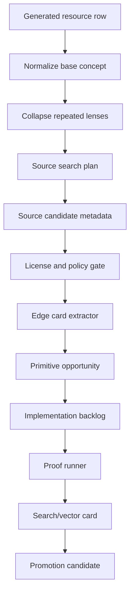
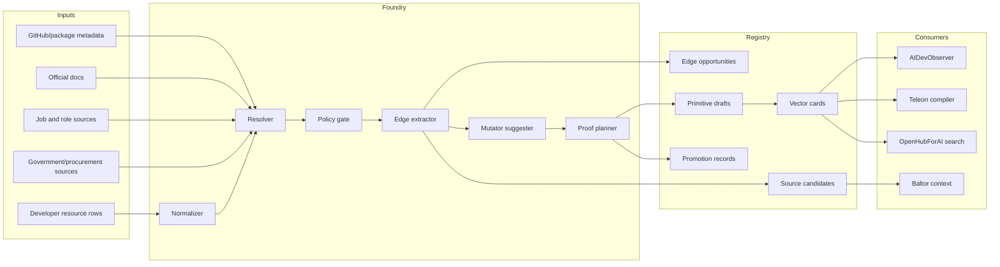
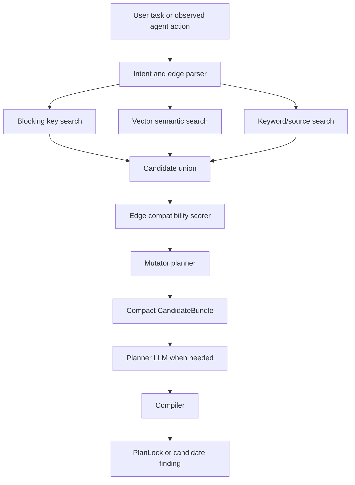

# Developer Resource Foundry Design

**Status:** design note  
**Purpose:** convert generated developer-resource leads into source-backed, edge-searchable primitive candidates.  
**Primary seed:** `developer_resources_10000_rows.md`

## Design Goal

The foundry should make the primitive database wider without wasting model context. The model can help interpret intent and choose route candidates, but deterministic workers should handle search, parsing, dedupe, source-policy checks, edge-card generation, proof checks, and registry writes.

The core design rule:

```text
LLM sees compact edge cards.
Deterministic workers fetch, copy, test, compile, and persist.
Promotion only happens after proof.
```

## High-Level Pipeline



## Component Diagram



## Candidate Record Families

### Developer Resource Seed

A seed row from `developer_resources_10000_rows.md`.

Required fields:

```text
seed_id
section
category
type
name
description
search_query
tags
source_file
serves_truth=false
```

### Source Candidate

Metadata for a real source found from a seed.

Required fields:

```text
source_candidate_id
source_url
source_type
source_title
source_policy
license_state
authority
freshness
privacy_risk
fetch_method
serves_truth=false
```

### Primitive Opportunity

A useful capability idea that is not yet an implementation.

Required fields:

```text
primitive_opportunity_id
label
blackbox_behavior
input_edge
output_edge
effects
memory
cache
runtime_targets
source_refs
proof_obligations
serves_truth=false
```

### Edge Card

Compact retrieval unit used by AIDevObserver and Teleon planning.

Recommended format:

```text
label: retry_with_backoff
edge: Callable+RetryPolicy -> Callable
behavior: wraps transient failures with bounded retry and jitter
effects: preserves wrapped callable effects
mutators: async_wrap, telemetry_wrap, idempotency_wrap
proof: max_attempts, no_retry_on_permanent_error, jitter_bounds
source: stdlib/docs/repo/test refs
```

### Primitive Draft

Implementation candidate with code, tests, runtime metadata, and source refs. It still does not serve truth until proof and promotion pass.

## Edge Model

Every reusable primitive needs these fields before it is useful in AIDevObserver:

| Field | Reason |
|---|---|
| Input edge | Lets retrieval match what the agent/user already has |
| Output edge | Lets planner chain routes without reading implementation code |
| Blackbox behavior | Lets LLM understand purpose without source |
| Effects | Prevents hidden writes, network calls, shell actions, and unsafe execution |
| Memory/cache policy | Lets compiler choose deterministic cache/reuse path |
| Runtime target | Lets system emit local, cloud function, Kubernetes, or worker routes |
| Complexity/resource profile | Helps choose efficient primitives and avoid overbuilt routes |
| Mutator options | Lets near-matches become exact matches without codegen |
| Proof obligations | Makes promotion measurable |

## Deterministic Mutator Catalog

These mutators let the system compose more routes without asking a coding harness to write glue code:

| Mutator | Edge transform |
|---|---|
| `scalar_to_sequence` | `A -> B` becomes `list[A] -> list[B]` |
| `sequence_to_scalar_reduce` | `list[A] -> list[B]` plus reducer becomes `list[A] -> B` |
| `dict_to_dataclass` | `dict[str,object] -> T` via schema constructor |
| `dataclass_to_dict` | `T -> dict[str,object]` via serializer |
| `path_to_bytes` | `Path -> bytes` |
| `bytes_to_stream` | `bytes -> BinaryIO` |
| `stream_to_records` | `TextIO -> list[Record]` via parser |
| `sync_to_async` | `A -> B` becomes `A -> Awaitable[B]` |
| `async_to_sync` | `A -> Awaitable[B]` becomes `A -> B` with runtime guard |
| `retry_wrapper` | `A -> B` becomes retryable `A -> B` |
| `cache_wrapper` | `A -> B` becomes cached `A -> B` |
| `idempotency_wrapper` | write route gains idempotency key |
| `artifact_ref_wrapper` | large output becomes `ArtifactRef` |
| `source_span_wrapper` | extracted fields gain provenance spans |
| `pagination_loop` | single-page fetch becomes all-page fetch |
| `batch_map` | single-item route becomes batch route |
| `map_reduce` | item route plus reducer becomes aggregate route |
| `validation_gate` | output gets schema validation before serving |
| `redaction_gate` | output gets PII/secret scrub |
| `kubernetes_job_wrapper` | callable route becomes K8 job manifest and runner |
| `cloud_function_wrapper` | callable route becomes cloud-function handler |

## Retrieval And Ranking

Use hybrid search. Vector search alone is not enough because exact edge compatibility matters.



Recommended blocking keys:

```text
normalized_verb
input_type
output_type
effect_family
runtime_target
domain
language
framework
source_authority
license_state
proof_state
mutator_surface
```

Recommended ranking features:

```text
exact input edge match
exact output edge match
fewest mutators needed
serves_truth/proof state
source authority
license clarity
runtime compatibility
complexity/resource fit
recent successful reuse
low dismissal rate
token savings estimate
```

## Token Compression Rules

The system should not inject code by default.

Use this context ladder:

1. Intent summary and target output contract.
2. Top edge cards only.
3. Mutator options and proof obligations.
4. Source refs and function/module paths.
5. Code snapshot only after route selection.

The LLM should see:

```text
label + edge + blackbox behavior + effects + mutators + source path
```

The LLM should not see:

```text
full file bodies
full docs pages
raw job listings
raw forum threads
unfiltered source dumps
```

## When To Use The LLM

Use deterministic logic for:

- exact edge search;
- obvious route templates;
- mutator applicability;
- file materialization from a compiled recipe;
- tests and proof checks;
- source-policy gates;
- digest and vector-row emission.

Use the LLM for:

- open-ended intent parsing;
- choosing between several plausible workflows;
- mapping natural-language task variants to edge vocabulary;
- explaining gaps;
- drafting a candidate blueprint when no deterministic route exists;
- classifying source evidence when deterministic parsing is insufficient.

## Example: Developer Resource Row To Primitive

Input row:

```text
Name: Topological sort - data engineering
Search: site:github.com "Topological sort" "data engineering" algorithm
```

Collapsed concept:

```text
topological_sort_dag
```

Edge card:

```text
input: DirectedGraph
output: TopologicalOrder
behavior: returns an order where every dependency appears before dependents
effects: none
mutators: dict_edges_to_graph, artifact_ref_wrapper
proof: cycle rejection, disconnected graph, stable tie-break option
```

Possible route:

```text
extract_dependency_graph -> topological_sort_dag -> emit_build_order
```

## Promotion Gate

A primitive can serve truth only after:

- source refs are stored;
- license and attribution status are recorded;
- implementation is local or rights-cleared;
- tests cover normal cases, edge cases, and failure modes;
- ledger replay is deterministic;
- output schema and side effects match the edge card;
- promotion record is created.

