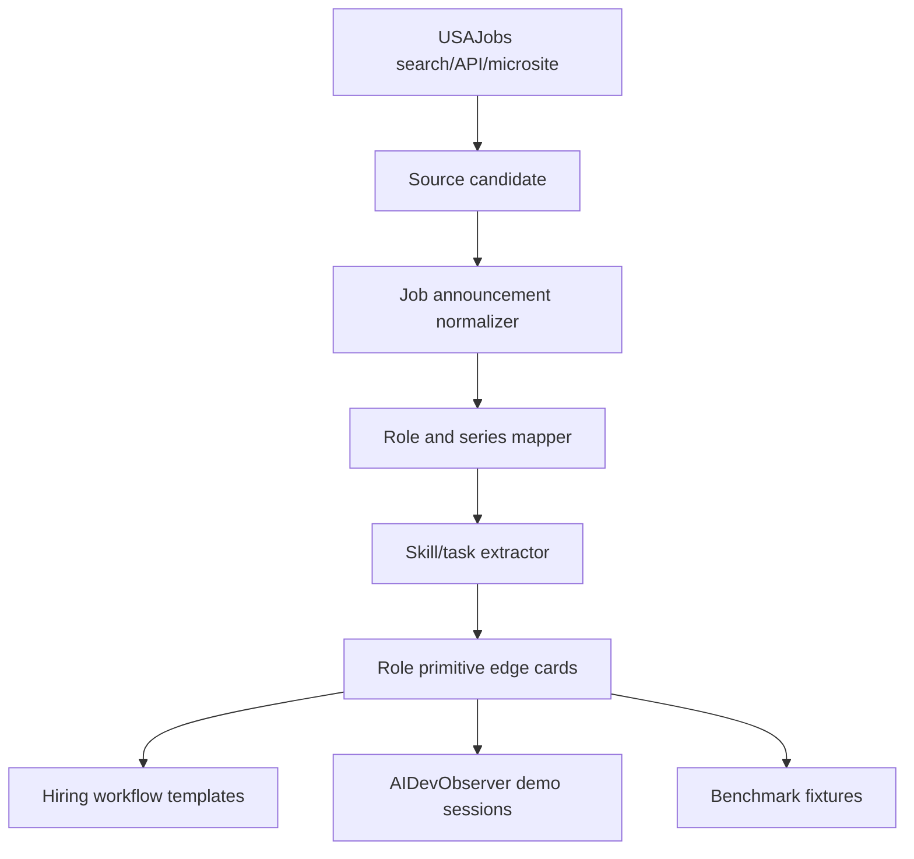
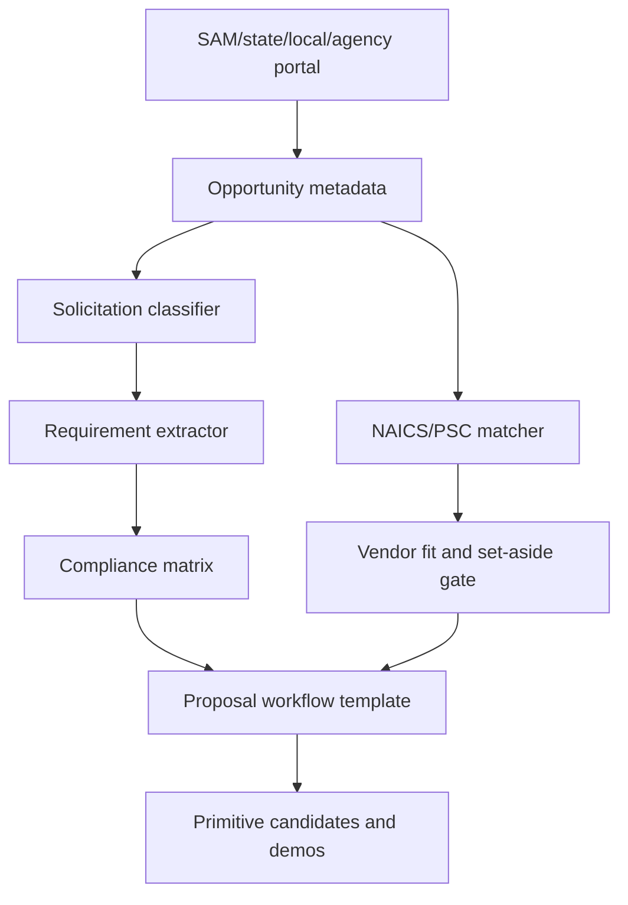

# Government Workforce And Procurement Source Map

**Status:** source-surface design note  
**Seed:** USAJobs, OPM, agency career pages, federal procurement portals, state/local procurement portals, and contractor/supplier pages supplied in the working session.  
**Truth boundary:** URL and category rows are source leads. They are not extracted records until scanned under source-policy gates.

## Why This Source Family Matters

Government hiring and procurement surfaces expose repeatable work:

- role descriptions;
- occupational series;
- eligibility paths;
- application steps;
- solicitation and award workflows;
- compliance requirements;
- proposal and vendor-registration tasks;
- agency-specific career and procurement processes.

Those are exactly the kinds of workflows that become reusable primitives, templates, rubrics, and source-backed demos.

## Primary URL Groups

### USAJobs Core And Search

Seed URLs:

```text
https://www.usajobs.gov/
https://www.usajobs.gov/Search/Results
https://www.usajobs.gov/Search/Results?hp=public
https://www.usajobs.gov/Search/Results?hp=student
https://www.usajobs.gov/Search/Results?hp=graduates
https://www.usajobs.gov/Search/Results?hp=veterans
https://www.usajobs.gov/Search/Results?rmi=true
```

Primitive opportunities:

| Primitive | Edge |
|---|---|
| `usajobs_search_query_builder` | `SearchIntent -> USAJobsQuery` |
| `usajobs_search_result_ingest` | `USAJobsQuery -> list[JobAnnouncementSummary]` |
| `hiring_path_classifier` | `JobAnnouncement -> HiringPathSet` |
| `remote_telework_flag_extractor` | `JobAnnouncement -> WorkArrangement` |
| `deadline_monitor` | `JobAnnouncement -> DeadlineEvent` |

### USAJobs Help And Application Workflow

Seed URLs:

```text
https://help.usajobs.gov/
https://help.usajobs.gov/how-to
https://help.usajobs.gov/how-to/account
https://help.usajobs.gov/how-to/search
https://help.usajobs.gov/how-to/application
https://help.usajobs.gov/working-in-government/unique-hiring-paths/public
https://help.usajobs.gov/working-in-government/unique-hiring-paths/students
https://help.usajobs.gov/working-in-government/unique-hiring-paths/recent-graduates
https://help.usajobs.gov/working-in-government/unique-hiring-paths/veterans
https://help.usajobs.gov/working-in-government/unique-hiring-paths/individuals-with-disabilities
https://help.usajobs.gov/working-in-government/unique-hiring-paths/federal-employees
```

Primitive opportunities:

| Primitive | Edge |
|---|---|
| `federal_application_step_extractor` | `HelpPage -> ApplicationStepSet` |
| `eligibility_requirement_extractor` | `HelpPage+ApplicantProfile -> EligibilityFindingSet` |
| `resume_requirement_checklist` | `JobAnnouncement -> ResumeChecklist` |
| `application_packet_validator` | `ApplicationPacket+JobAnnouncement -> ValidationReport` |
| `candidate_next_action_router` | `ValidationReport -> NextActionSet` |

### USAJobs Developer API

Seed URLs:

```text
https://developer.usajobs.gov/
https://developer.usajobs.gov/api-reference/
https://developer.usajobs.gov/api-reference/get-api-search
https://developer.usajobs.gov/apirequest/
```

Primitive opportunities:

| Primitive | Edge |
|---|---|
| `usajobs_api_auth_config` | `APIKeyConfig -> AuthHeaderSet` |
| `usajobs_api_search_client` | `USAJobsQuery -> USAJobsSearchResponse` |
| `usajobs_response_normalizer` | `USAJobsSearchResponse -> list[JobAnnouncement]` |
| `usajobs_api_error_classifier` | `HTTPResponse -> APIErrorClassification` |
| `usajobs_snapshot_writer` | `list[JobAnnouncement] -> VersionedArtifactRef` |

### Occupational Microsites

Seed URL families include:

```text
https://actuary.usajobs.gov/
https://computerscience.usajobs.gov/
https://mathematics.usajobs.gov/
https://mathematicalstatistics.usajobs.gov/
https://statistics.usajobs.gov/
https://civil.usajobs.gov/
https://general.usajobs.gov/
https://mechanical.usajobs.gov/
https://hrmanagement.usajobs.gov/
https://acquisitions.usajobs.gov/
https://auditing.usajobs.gov/
https://natsec.usajobs.gov/
https://stem.usajobs.gov/
https://economist.usajobs.gov/
https://nurse.usajobs.gov/
https://chemistry.usajobs.gov/
https://naturalresources.usajobs.gov/
https://physicalscience.usajobs.gov/
https://healthphysics.usajobs.gov/
https://physics.usajobs.gov/
https://ai.usajobs.gov/
https://tech.usajobs.gov/
https://itmanagement.usajobs.gov/
https://crossfunctional.usajobs.gov/
https://cybersecurity.usajobs.gov/
https://cybereffects.usajobs.gov/
https://informationtechnology.usajobs.gov/
https://intel.usajobs.gov/
https://othercyber.usajobs.gov/
```

Primitive opportunities:

| Primitive | Edge |
|---|---|
| `occupation_microsite_indexer` | `MicrositeURL -> OccupationSourceCard` |
| `role_series_mapper` | `OccupationSourceCard -> JobSeriesCandidate` |
| `role_skill_task_edge_extractor` | `OccupationSourceCard -> RoleTaskSkillEdges` |
| `federal_role_demo_session_generator` | `RoleTaskSkillEdges -> AIDevObserverSessionSpec` |

### Job Series Search URLs

The supplied series-search URLs cover series such as security administration, emergency management, intelligence, human resources, administrative analysis, finance, accounting, auditing, budget, health science, engineering, architecture, legal, public affairs, business, contracting, purchasing, realty, physical science, chemistry, operations research, statistics, computer science, data science, investigations, quality assurance, supply, transportation, air traffic control, and IT management.

Examples:

```text
https://www.usajobs.gov/Search/Results?j=0343
https://www.usajobs.gov/Search/Results?j=1102
https://www.usajobs.gov/Search/Results?j=1515
https://www.usajobs.gov/Search/Results?j=1550
https://www.usajobs.gov/Search/Results?j=1560
https://www.usajobs.gov/Search/Results?j=2210
```

Primitive opportunities:

| Primitive | Edge |
|---|---|
| `job_series_code_parser` | `USAJobsURL -> JobSeriesCode` |
| `job_series_to_role_family` | `JobSeriesCode -> RoleFamilyCandidate` |
| `series_search_snapshotter` | `JobSeriesCode -> SearchSnapshotArtifact` |
| `series_demand_signal_calculator` | `SearchSnapshot -> DemandSignal` |
| `series_to_primitive_backlog` | `RoleFamilyCandidate+DemandSignal -> PrimitiveBacklogItems` |

### Keyword Role Tracks

The supplied keyword searches cover contract specialist, contracting officer, procurement analyst, purchasing agent, acquisition, grants management, program analyst, management analyst, project/program/product manager, business analyst, operations analyst, budget/financial analyst, accountant, auditor, HR, staffing, IT, cybersecurity, software, data science, AI, cloud, systems administration, networking, database administration, DevSecOps, intelligence, emergency management, communications, legal, engineering, logistics, supply, transportation, environmental, economics, statistics, healthcare, remote, telework, internship, and Pathways.

Primitive opportunities:

| Primitive | Edge |
|---|---|
| `role_keyword_query_builder` | `RoleKeyword -> USAJobsQuery` |
| `role_demand_heatmap` | `list[SearchSnapshot] -> RoleDemandReport` |
| `role_requirement_clusterer` | `list[JobAnnouncement] -> RequirementClusterSet` |
| `skill_to_training_resource_router` | `RequirementClusterSet -> TrainingRouteSet` |

## Procurement And Grants Source Families

Federal seed URLs include:

```text
https://sam.gov/
https://sam.gov/opportunities
https://sam.gov/search/?index=opp
https://open.gsa.gov/api/get-opportunities-public-api/
https://www.usaspending.gov/
https://api.usaspending.gov/docs/
https://www.fpds.gov/
https://www.acquisition.gov/far/
https://www.grants.gov/search-grants
https://www.sbir.gov/solicitations
https://www.challenge.gov/
```

Agency procurement examples include DHS, FEMA, CISA, DOJ, HHS, NIH, CDC, VA, DLA, DoD, Air Force, Army, Navy, NASA, DOE, DOT, FAA, EPA, DOI, USDA, Commerce, State, USAID, Treasury, IRS, SEC, FDIC, CFPB, Federal Reserve, MCC, NEH, NSF, EDA, HUD, DOL, and other grant/procurement surfaces.

State and local procurement examples include procurement portals for Alabama, Alaska, Arizona, California, Colorado, Connecticut, Delaware, DC, Florida, Georgia, Hawaii, Idaho, Illinois, Indiana, Iowa, Kansas, Kentucky, Louisiana, Maine, Maryland, Massachusetts, Michigan, Minnesota, Mississippi, Missouri, Montana, Nebraska, Nevada, New Hampshire, New Jersey, New Mexico, New York, North Carolina, North Dakota, Ohio, Oklahoma, Oregon, Pennsylvania, Rhode Island, South Carolina, South Dakota, Tennessee, Texas, Utah, Vermont, Virginia, Washington, West Virginia, Wisconsin, Wyoming, Guam, Puerto Rico, Virgin Islands, and major cities.

Primitive opportunities:

| Primitive | Edge |
|---|---|
| `sam_opportunity_ingest` | `SAMQuery -> list[Opportunity]` |
| `solicitation_type_classifier` | `Opportunity -> SolicitationType` |
| `naics_psc_matcher` | `Opportunity -> ClassificationCodeSet` |
| `set_aside_policy_gate` | `Opportunity+VendorProfile -> EligibilityFinding` |
| `proposal_requirement_extractor` | `SolicitationArtifact -> RequirementChecklist` |
| `compliance_matrix_builder` | `RequirementChecklist+ProposalOutline -> ComplianceMatrix` |
| `deadline_and_qna_monitor` | `Opportunity -> DeadlineEventSet` |
| `award_history_enricher` | `VendorOrAgency -> AwardHistoryProfile` |
| `state_local_bid_normalizer` | `BidPortalRecord -> NormalizedBidOpportunity` |
| `vendor_portal_adapter` | `VendorPortalSpec -> PortalWorkflowTemplate` |

## Workforce And Procurement Diagrams

### USAJobs Role Pipeline



### Procurement Pipeline



## Candidate Edge Cards

```text
label: usajobs_api_search_client
edge: USAJobsQuery -> USAJobsSearchResponse
behavior: calls the USAJobs search API with authenticated headers and returns JSON search results
effects: net.read
cache: ttl
mutators: pagination_loop, response_normalizer, artifact_ref_wrapper
proof: fixture response parse, auth header redaction, pagination stop condition
serves_truth: false
```

```text
label: job_announcement_to_role_task_edges
edge: JobAnnouncement -> RoleTaskSkillEdges
behavior: extracts responsibilities, skills, series, grade, hiring path, location, and eligibility signals from an announcement
effects: none
cache: content_hash
mutators: source_span_wrapper, redaction_gate, field_rename_map
proof: schema validation, source-span coverage, no applicant PII
serves_truth: false
```

```text
label: solicitation_to_compliance_matrix
edge: SolicitationArtifact -> ComplianceMatrix
behavior: turns solicitation requirements into a response checklist with due dates, mandatory forms, evaluation factors, and evidence fields
effects: none
cache: content_hash
mutators: source_span_wrapper, artifact_ref_wrapper, requirement_grouping
proof: citation span coverage, required-field validation, attachment policy gate
serves_truth: false
```

## Governance Rules

- Prefer official APIs over browser scraping when available.
- Store metadata, URLs, timestamps, and source refs before document bodies.
- Do not store applicant resumes, private candidate messages, or account data.
- Redact API keys, user IDs, emails, phone numbers, and private vendor data.
- Treat job descriptions and solicitation text as source-owned content.
- Store source-span references for any extracted requirement or role claim.
- Keep all generated role, procurement, and application workflow rows as `serves_truth=false` until proof and promotion.

## How This Feeds The Primitive Foundry

```text
USAJobs/procurement URL seed
  -> source candidate
  -> role/procurement workflow edge cards
  -> AIDevObserver demo sessions
  -> primitive opportunities
  -> implementation/proof backlog
  -> compact search cards
```

High-value first demos:

1. Build a federal job search monitor for a role series and location.
2. Extract role requirements from USAJobs announcements into a skill checklist.
3. Match a vendor profile to SAM.gov opportunities by NAICS, set-aside, and deadline.
4. Build a proposal compliance matrix from a solicitation artifact.
5. Compare federal job roles to private-sector job descriptions and identify reusable training modules.

