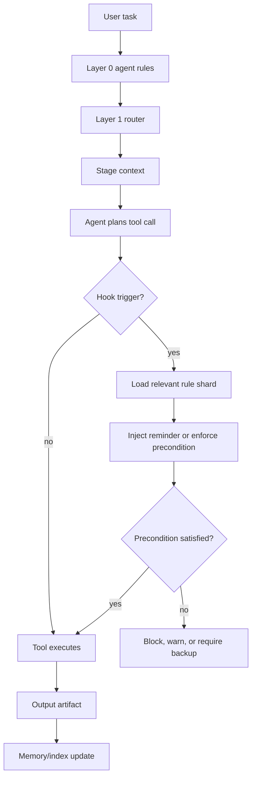
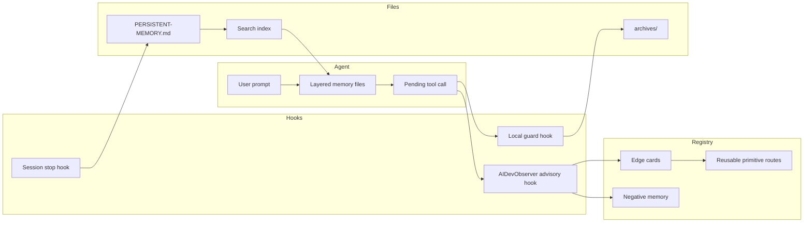

# Hook-Enforced Staged Memory System

**Status:** source-backed design note  
**Primary source:** `CreativLogic/Staged-Memory-System` on GitHub  
**Source URL:** `https://github.com/CreativLogic/Staged-Memory-System`  
**License signal:** repository metadata reports an unspecified license class, while the README names GPL-V2. Treat implementation/template reuse as GPL-gated until license review.  
**Truth boundary:** this doc records candidate architecture and primitive opportunities, not promoted registry truth.

## Why This Matters

The useful lesson is that passive memory files are not enough. A coding agent may read `CLAUDE.md`, `SOUL.md`, memory files, or stage files at startup, then still fail later because it optimizes for speed and stops rechecking the rules.

The reusable pattern is:

```text
short persistent instructions
  + staged files
  + local search
  + hook-triggered context reminders
  + tool-time guardrails
```

For AIDevObserver, this strengthens the product story. The observer should not only review completed sessions. It should also provide lightweight in-session hooks that remind the agent about reusable primitives, required context, destructive-operation hygiene, token-saving routes, and local memory rules at the moment a tool call is about to happen.

## Source Summary

The Staged Memory System is a filesystem-first memory framework. Its public README describes:

- a layered loading model using root agent files, task routing, per-stage context, reference files, and working artifacts;
- small context files with explicit line limits;
- markdown files as memory and workflow state;
- local semantic search through GBrain;
- context compression through Context Mode;
- portability through folders, git, or sync tools;
- a hard file-hygiene rule: back up before deletion.

The linked social post adds the operational insight: hooks can inject rule reminders or enforce preconditions when an agent is about to call a shell/tool action, solving cases where the model forgets rules during multi-step work.

## Architecture Pattern



## Hook Types As Primitives

| Hook family | Trigger | Useful primitive |
|---|---|---|
| Shell/tool hook | command, write, edit, delete, network call | `tool_call_policy_gate` |
| Context injection hook | command/action pattern | `rule_shard_context_injector` |
| Session lifecycle hook | start, stop, resume | `session_briefing_and_memory_update` |
| Artifact hook | file create/update/delete | `archive_before_delete_guard` |
| Registry hook | build/create/import action | `primitive_reuse_lookup_hint` |
| Token hook | large read, full repo scan, repeated file open | `wasted_context_detector` |

## AIDevObserver Mapping

AIDevObserver already has a non-blocking `PreToolUse` hook path:

```text
scripts/aidevobserver_hook.py
hooks/pretooluse-aidevobserver.md
```

Today that hook is intentionally advisory:

```text
tool call -> observer route -> reinvention/waste/footgun note -> never blocks
```

The SMS pattern suggests a second lane:

```text
tool call -> local rule precondition -> deterministic guard -> allow/block/fix
```

These should stay separate:

| Lane | Purpose | Blocking? |
|---|---|---|
| AIDevObserver advisory hook | reuse hints, token-savings hints, registry routes | no |
| Local safety/context guard hook | destructive operations, required backups, private-memory policy | optionally yes |
| Teleon compiler/proof gate | route execution and promotion truth | yes, when compiling/executing |

This avoids turning AIDevObserver into surveillance or policy enforcement while still supporting teams that want hard local rules.

## Candidate Primitive Cards

```text
label: staged_memory_workspace_template
edge: ProjectPurpose+StageList -> WorkspaceScaffold
behavior: creates root agent file, task router, stage folders, references, outputs, and memory files
effects: fs.write
mutators: agent_name_adapter, stage_set_adapter, repo_root_adapter
proof: expected paths exist, line-limit checks pass, no private data copied
source_ref: https://github.com/CreativLogic/Staged-Memory-System
serves_truth: false
```

```text
label: layered_context_router
edge: TaskIntent+WorkspaceIndex -> ContextLoadPlan
behavior: selects the smallest set of files needed for the current task
effects: fs.read
mutators: semantic_search_adapter, keyword_search_adapter, stage_scope_filter
proof: avoids loading unrelated layers, preserves required hard rules
source_ref: https://github.com/CreativLogic/Staged-Memory-System
serves_truth: false
```

```text
label: rule_shard_context_injector
edge: ToolCall+RuleIndex -> ContextReminder
behavior: injects only the relevant rule shard before a risky or rule-sensitive tool call
effects: none
mutators: command_pattern_matcher, file_path_scope_matcher, severity_filter
proof: correct rule selected for delete/write/shell cases, no unrelated rule spam
source_ref: https://github.com/CreativLogic/Staged-Memory-System
serves_truth: false
```

```text
label: archive_before_delete_guard
edge: DeleteIntent+FileSnapshot -> DeleteDecision
behavior: requires a restorable archive copy before delete/move/destructive overwrite
effects: fs.read, fs.write
mutators: git_tracked_file_guard, folder_archive_guard, dry_run_guard
proof: archive created before delete, manifest written, restore test passes
source_ref: https://github.com/CreativLogic/Staged-Memory-System
serves_truth: false
```

```text
label: local_markdown_memory_index
edge: WorkspaceMarkdownSet -> MemorySearchIndex
behavior: indexes local markdown memory and stage outputs for keyword or semantic recall
effects: fs.read, fs.write
mutators: gbrain_adapter, sqlite_fts_adapter, pgvector_adapter, freshness_filter
proof: changed files reindexed, private paths scoped, query returns source refs
source_ref: https://github.com/CreativLogic/Staged-Memory-System
serves_truth: false
```

```text
label: session_end_memory_update
edge: SessionLedger+MemoryPolicy -> MemoryPatch
behavior: summarizes durable decisions, corrections, active projects, and next actions into local memory
effects: fs.write
mutators: redaction_gate, source_link_wrapper, human_review_gate
proof: no secrets, no raw transcript dump, source refs retained
source_ref: https://github.com/CreativLogic/Staged-Memory-System
serves_truth: false
```

## Integration Diagram



## AIDevObserver Product Implications

1. Review mode should identify rules the agent ignored.
2. Hook mode should show when it prevented token waste or surfaced a reusable primitive.
3. Guard mode should be optional and local, not a default public-demo behavior.
4. The UI should separate `advice`, `guard`, and `proof` lanes.
5. Every hook finding should include source refs and a short reason.
6. Dismissed hook findings should become negative memory.
7. Accepted hook findings should become reusable team/project memory.

## Implementation Notes

The existing AIDevObserver `PreToolUse` hook should remain fail-open and non-blocking. A separate guard hook can implement backup-before-delete as deterministic local policy.

Suggested command lifecycle:

```text
Delete/Edit/Move requested
  -> detect destructive intent
  -> read archive policy
  -> create archive copy
  -> write archive manifest event
  -> allow original tool call
```

Suggested archive manifest event:

```json
{"ev":"archive.before_delete","src":"path/to/file.md","archive":"archives/path/to/file.md","sha256":"...","reason":"tool_call_policy","ts":"..."}
```

## Open Questions

- Should AIDevObserver ship a hard guard hook, or only generate one into the user's project?
- Should backup-before-delete be enforced for all files, only git-tracked files, or only selected folders?
- Should local markdown memory be indexed by SQLite FTS, GBrain, pgvector, or a pluggable adapter?
- Should hook findings appear in the same session export as model output and file actions?
- How should GPL-derived templates be separated from source-inspired but independently implemented primitives?

