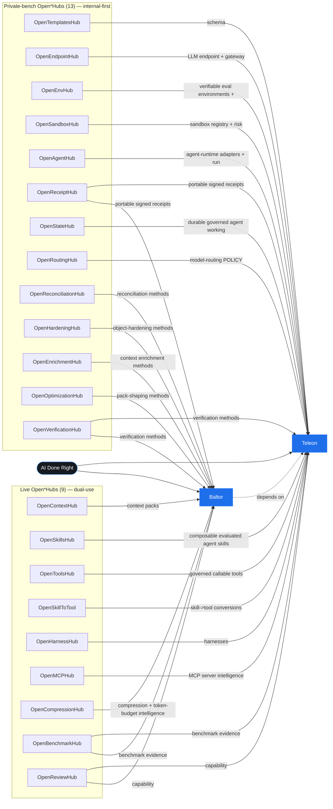

# Portfolio connection map

> GENERATED by `scripts/build_portfolio_connection_map.py` from `architecture/portfolio_connection_map.json` (names cross-checked against `products.js`). Do not hand-edit.

**The spine:** help people use AI better — move each unit of work *unbounded & inefficient → most-bounded & most-efficient*, on context kept *true / current / provable*, defined by *capability*, getting *smarter over time*.

**Shape:** 2 core products (Baltor, Teleon) consume content from **22 Open\*Hubs** (9 live + 13 private-bench).

**Amazon strategy:** Each Open*Hub is built as INTERNAL infrastructure that Baltor/Teleon consume first, with the ability to spin it out as a PUBLIC, independently-monetizable Open*Hub.io registry later — the AWS pattern (internal infra -> public revenue stream).

**Dependency law:** Baltor -> Teleon -> OpenHarnessHub/Open*Hubs, NEVER reverse (enforced by check_portfolio_dependency_law). Content flows hub -> core (the core CONSUMES from hubs); a hub never depends on the core.

## Live Open\*Hubs (dual-use: open registry + internal infra)

| Hub | Provides | Consumed by | Amazon stage |
|---|---|---|---|
| OpenContextHub | context packs | baltor | dual-use: already a live open registry AND internal infra the core consumes |
| OpenSkillsHub | composable evaluated agent skills | teleon | dual-use: already a live open registry AND internal infra the core consumes |
| OpenToolsHub | governed callable tools | teleon | dual-use: already a live open registry AND internal infra the core consumes |
| OpenSkillToTool | skill->tool conversions | teleon | dual-use: already a live open registry AND internal infra the core consumes |
| OpenHarnessHub | harnesses / templates / eval packs | teleon | dual-use: already a live open registry AND internal infra the core consumes |
| OpenMCPHub | MCP server intelligence (discovery!=trust) | teleon | dual-use: already a live open registry AND internal infra the core consumes |
| OpenCompressionHub | compression + token-budget intelligence | baltor | dual-use: already a live open registry AND internal infra the core consumes |
| OpenBenchmarkHub | benchmark evidence (not authority) | both | dual-use: already a live open registry AND internal infra the core consumes |
| OpenReviewHub | capability/reproducibility review | both | dual-use: already a live open registry AND internal infra the core consumes |

## Private-bench Open\*Hubs (internal-first; public-revenue candidates)

| Hub | Provides | Consumed by | Amazon stage |
|---|---|---|---|
| OpenTemplatesHub | schema/runtime/resource/API-UI/inference/PurposeTask template families | teleon | internal-first: private infra now; a public-revenue candidate when its trigger fires |
| OpenEndpointHub | LLM endpoint + gateway due-diligence (model info, data-class/jurisdiction) | teleon | internal-first: private infra now; a public-revenue candidate when its trigger fires |
| OpenEnvHub | verifiable eval environments + reward specs | teleon | internal-first: private infra now; a public-revenue candidate when its trigger fires |
| OpenSandboxHub | sandbox registry + risk/conformance | teleon | internal-first: private infra now; a public-revenue candidate when its trigger fires |
| OpenAgentHub | agent-runtime adapters + run receipts | teleon | internal-first: private infra now; a public-revenue candidate when its trigger fires |
| OpenReceiptHub | portable signed receipts (the attestation face) | both | internal-first: private infra now; a public-revenue candidate when its trigger fires |
| OpenStateHub | durable governed agent working state | teleon | internal-first: private infra now; a public-revenue candidate when its trigger fires |
| OpenRoutingHub | model-routing POLICY (preference cards, lane policy, model info) | teleon | internal-first: private infra now; a public-revenue candidate when its trigger fires |
| OpenReconciliationHub | reconciliation methods (cluster align, dedupe, contradictions) | baltor | internal-first: private infra now; a public-revenue candidate when its trigger fires |
| OpenHardeningHub | object-hardening methods (brittle text -> refreshing objects) | baltor | internal-first: private infra now; a public-revenue candidate when its trigger fires |
| OpenEnrichmentHub | context enrichment methods (metadata, relationships, graphs) | baltor | internal-first: private infra now; a public-revenue candidate when its trigger fires |
| OpenOptimizationHub | pack-shaping methods (summarize/distill, unstructured->structured, fit budget = the descent) | baltor | internal-first: private infra now; a public-revenue candidate when its trigger fires |
| OpenVerificationHub | verification methods (bind claim->source, prove by hash, hold out the unprovable) | both | internal-first: private infra now; a public-revenue candidate when its trigger fires |
