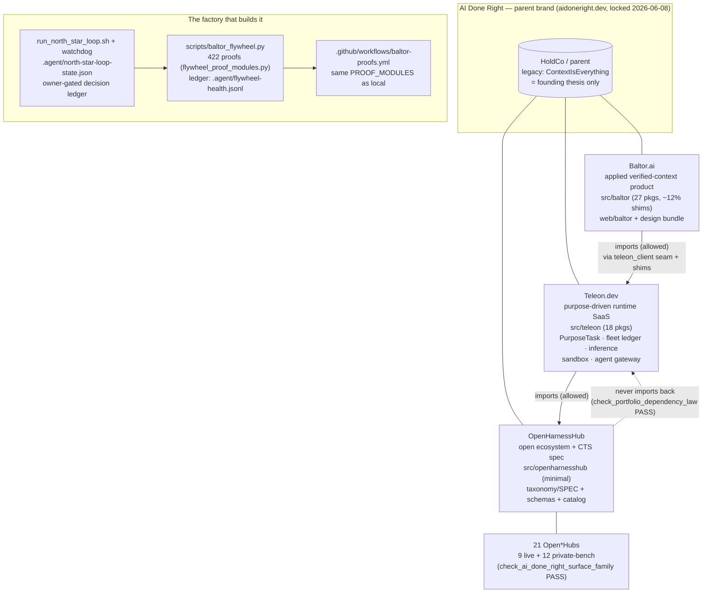
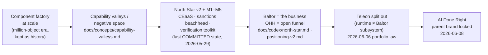

# Full Codebase Review — 2026-06-09

> Historical snapshot (2026-06-09). Kept for lineage. It describes an earlier state and may name superseded things (for example Hanken Grotesk, surface_server as the renderer, Open Harness Hub as the headline brand). Current canonical: docs/BIBLE.md, docs/CURRENT-STATE.md, and docs/DESIGN-BIBLE.md.

Method: seven parallel read-only explorations (strategy/goals, runtime code,
scripts/proofs, data model, web surfaces, agent ops, research/evidence) plus
targeted hand-verification of contested findings. All counts below are
**snapshots as of 2026-06-09** — the canonical sources are the proof scripts
named in each section, never this prose (see `docs/codex/no-magic-values.md`).
Branch reviewed: `feat/scale-goals-and-hygiene` (working tree, not git
history — see Hygiene H1).

---

## 1. Executive summary

1. **The architecture story is coherent and enforced.** Baltor → Teleon →
   OpenHarnessHub dependency law holds in code (0 reverse imports across
   ~280 `.py` files; `scripts/check_portfolio_dependency_law.py` PASS). The
   Baltor→Teleon extraction is **complete** — 24 lossless re-export shims,
   `src/baltor/teleon_client` as the versioned seam, zero remaining
   migration debt per `architecture/portfolio_dependency_law.json`.
2. **The proof flywheel is the real test system.** 422 modules registered in
   `scripts/flywheel_proof_modules.py`, run continuously by
   `scripts/baltor_flywheel.py` and by CI (`baltor-proofs.yml`) from the same
   single source. Last ledger tick: 421/422 green (`check_demo_control_tower`
   red). `tests/` is empty by design — proofs replace unit tests.
3. **The single biggest risk is git hygiene, not architecture**: last commit
   is 2026-05-29; ~10 days of work (1,666 modified + 8,027 untracked files —
   the entire Teleon extraction, the AI Done Right design bundle, all
   `.agent/` state) exists **only in the working tree**. One disk failure or
   branch mistake loses it.
4. **Strategy docs lag the locked decisions.** The parent brand is AI Done
   Right (locked 2026-06-08), but `docs/strategy/teleon-naming-and-domain.md`
   still calls the parent "ContextIsEverything (working name … clearance
   pending)", and `README.md` still leads with the older OHH-builder story
   and legacy vocabulary ("knowledge pack", "rule pack").
5. **Hub counts are healthy where computed**: `check_ai_done_right_surface_family.py`
   PASS — 2 products, 9 live Open*Hubs, 12 private-bench hubs (21 total),
   full five-stage Baltor method spine, every prototype HTML present.
6. **Real measured evidence exists** (live OFAC ingestion + constraint hold,
   15-assertion Chrome e2e of the verified-context flow, capability-lift cull
   of 1,980 filler components, deterministic context-rot lifecycle), but the
   headline metric — **measured pipeline-vs-bare-model lift — is still
   unpopulated**, blocked on real embeddings (no torch/sentence-transformers
   in the sandbox; placeholder hash embedder is non-promotable).
7. **Data model is ahead of its spec.** `db/postgres/schema.sql` implements
   all 10 required row families plus `processor`/`pattern` types and
   `component_layer`/`control_flow_kind` enums that `taxonomy/SPEC.md`
   (v0.1.0) doesn't define; `scripts/validate.py` TYPE_TO_SCHEMA lacks
   `pattern`.
8. **Known magic values remain**: `vector(384)` hardcoded at
   `db/postgres/schema.sql:565` (an audit script exists,
   `scripts/audit_context_storage.py`, but the settings-registry migration
   hasn't happened); `-v1` suffixes survive in ~15+ catalog slugs.
9. **Agent-ops machinery is sound but heavy**: durable external loop runner +
   watchdog + owner-gated decision ledger all consistent;
   `.agent/flywheel-health.jsonl` has grown to ~97 MB with no rotation;
   `.claude/settings.local.json` carries ~197 allow entries including broad
   patterns.
10. **The design bundle is the brand truth surface.**
    `dist/sites/openharness-design/` (24+ surfaces, config-driven `makeHub`)
    is canonical for brand/design; production `web/` apps have NOT yet
    adopted the shared tokens (fonts differ). Two Baltor frontends coexist
    intentionally (prototype vs production).

---

## 2. What this repo is (one paragraph)

A single monorepo carrying three product layers and their factory: the
**OpenHarnessHub** open ecosystem (taxonomy SPEC + JSON schemas + a 2,779-file
component catalog + static sites), the **Teleon** runtime substrate
(`src/teleon/` — workers/fleet ledger, execution backends, purpose tasks,
inference gateway, sandbox, agent gateway), the **Baltor** applied
verified-context product (`src/baltor/` — context engine stages, contextops,
distillation, facts, security, api), plus the autonomous-agent operating
system that builds it all (`scripts/` proof flywheel, `.agent/` ledgers,
`.claude/commands/` loops, `prompts/` build specs) and the brand/design layer
(`dist/sites/openharness-design/`, `web/`).

## 3. Portfolio & dependency graph

Law file: `architecture/portfolio_dependency_law.json` (migration_status: all
steps RESOLVED). Verified clean: Teleon never imports Baltor; OpenHarnessHub
imports neither.

## 4. Goal genealogy & pivot timeline

| Doc | Role today |
|---|---|
| `docs/codex/master-goal.md` (2026-05-31) | Strategic mission + phases; claims "single canonical goal" |
| `docs/codex/north-star.md` (2026-05-29) | Two-product crystallization: Baltor business / OHH funnel, M1–M5 |
| `docs/strategy/north-stars.md` | Six standing strategic anchors (negative space, lift+durability, governance…) |
| `docs/strategy/positioning-v2.md` | Canonical positioning |
| `docs/strategy/teleon-baltor-openharnesshub-portfolio.md` (2026-06-06) | Canonical portfolio architecture |
| `docs/strategy/brand-architecture.md` (updated 2026-06-08) | Parent = AI Done Right; Baltor narrative |
| `docs/codex/baltor-clean-context.md` + `baltor-autonomous-goal.md` | Active `/goal` execution layer |
| `docs/codex/ai-done-right-family-polish-goal.md` + `docs/goals/aidoneright-portfolio-loop.md` | Current portfolio polish loop (parser-safe `/goal` entry) |

Reconciliation rule that holds across them (from `master-goal.md`): "if any
appendix contradicts this page, this page is correct" — but several
appendices/older docs have not been updated in the same change (see
conflicts G1, G3, G4 below), which violates the repo's own
change-verification contract ("no orphaned contradictions").

## 5. Code plane (verified)

- **src/teleon (18 subpackages)** — real implementations: `workers/` (fleet
  ledger = truth, dispatch, emulators, pools), `experiments/` (parallel-path
  engine), `purpose_tasks/`, `runtime/` (execution-provider port + backend
  selector), `inference/` (OIPS routing above `scripts/llm_gateway`),
  `sandbox/`, `agent_gateway/`, `blackboard/`, `stateful_swarms/`,
  `templates/`, `io/`, `ports/`.
- **src/baltor (27 subpackages, ~199 files)** — applied product: context
  engine processors (12), contextops (source discovery / research /
  verification), distillation (lossless storage + lineage), facts, artifact
  graph, security, api, sales, observability; ~24 files are explicit
  RE-EXPORT shims into Teleon; `teleon_client/` is the boundary seam.
- **src/openharnesshub** — minimal (auth_kit) by design; the open layer
  mostly lives as spec + catalog + sites, not Python.
- **architecture/** — ~94 JSON registries (dependency law, brand.json,
  candidate_open_hubs.json, worker/pricebook/pattern/template/contract
  registries, provider catalogs, runtime landscape).
- **services/** — deployment/product stubs, no overlap with `src/` runtime.

## 6. Data plane (verified)

- `taxonomy/SPEC.md` v0.1.0 + 57 schema files; envelope via
  `schemas/_common.schema.json`.
- Catalog ≈ 2,779 YAML/JSONL files: knowledge-packs 715, pipelines 424,
  rule-packs 402, rubrics 245, personas 233, datasets 205, harnesses 195,
  processors 179, tools 173, benchmarks 111, patterns 56, adapters 20,
  logic-packs 2. (Directory names are legacy paths; product vocabulary is
  Knowledge Corpus / If Statement / Action.)
- All 10 required row families implemented in `db/postgres/schema.sql`
  (source_record … review_ticket) with CDC tables, promotion/approval
  decisions, import-batch ledger. Staging→promotion pipeline is real;
  **committed-at-scale volume is unproven** (no audited Postgres load).
- Hash discipline: 16-char canonical-hash suffixes in ID generation
  (`scripts/db/component_cdc_plan.py`, `scripts/acquisition/cell_priority.py`);
  no truncation-only IDs found.

## 7. Evidence ledger — proven vs aspirational

**Real, measured (keep citing):**
- Live OFAC SDN ingestion → constraint violation caught → held-out → verified
  claim served (`scripts/demo_context_engine_proof.py --live`, 2026-06-04).
- E2E verified-context flow in real Chrome — 15 assertions, trace + GIF in
  `e2e/artifacts/` (`e2e/record_demo.mjs`).
- Capability-lift gate culled 1,980 filler components (4,377→2,397 YAML),
  audit at `dist/reports/capability-lift-gate.json`.
- Deterministic context-rot lifecycle 11/11 (`scripts/ingest/context_rot.py`).
- Vector store: 505 objects / 1,024 edges committed; FTS5 lexical works.
- Throughput: 1k-seed partition ≈ 31 s measured; 10k monolithic hung →
  partitioned path is the proven shape.
- Worker cost/budget gates with adversarial fixtures; 422-proof flywheel
  green (421/422 last tick); dependency-law + family-surface checks PASS.

**Aspirational / blocked (do not cite as done):**
- Measured pipeline-vs-bare-model lift results (blocked: real embeddings need
  torch/sentence-transformers; hash-embedder placeholder is non-promotable).
- Millions of committed Postgres rows; production hosting ownership.
- Teleon greenfield TS control plane (`prompts/teleon-build-kit.md`) and ~19
  queued `prompts/baltor-*.md` build specs.
- "+16.4pp SkillsBench lift" — external claim; stream-3 notes 18/84 tasks
  are no-lift/silent/break. Use only with the two-axis gate caveat.

## 8. CONFLICT REGISTER

Severity: ▲ high (misleads users/agents today) · ● medium · ○ low/accepted.

| # | Conflict | Evidence | Status / resolution |
|---|---|---|---|
| G1 ▲ | Parent brand: AI Done Right locked vs "ContextIsEverything (working name, clearance pending)" still asserted | `docs/strategy/brand-architecture.md` (locked 2026-06-08) vs `docs/strategy/teleon-naming-and-domain.md` L11 | Stale doc; update naming doc in same change per change-verification contract |
| G2 ▲ | README leads with old product story + legacy vocabulary ("knowledge pack", "rule pack", builder-first) | `README.md` L84–91 vs `CLAUDE.md` vocabulary + `docs/codex/north-star.md` (Baltor=business, OHH=funnel) | README rewrite needed (user-facing first lie) |
| G3 ● | CEaaS→Baltor code rename acknowledged but unexecuted (`services/products/context_enrichment/`, `oh_ce` CLI) | `docs/strategy/brand-architecture.md` L23–24 | Tracked follow-up; keep or schedule, don't let it silently rot |
| G4 ● | Two registries, under-specified relationship: Teleon owns PurposeTask/CapabilityTask registry; OHH owns component registry | portfolio doc L99–104 vs `master-goal.md` L23–29 | Needs one paragraph in portfolio doc declaring them orthogonal + the join object |
| G5 ● | Schema ahead of spec: `processor`/`pattern` types + `component_layer`/`control_flow_kind` enums absent from SPEC v0.1.0; `validate.py` TYPE_TO_SCHEMA lacks `pattern` | `db/postgres/schema.sql:26–30` · `schemas/processor.schema.json` · `scripts/validate.py:60–74` | Spec bump + validator mapping |
| G6 ● | `vector(384)` magic value (audit exists, migration not done) | `db/postgres/schema.sql:565` · `scripts/audit_context_storage.py:140–160` | Move to settings registry per no-magic-values law |
| G7 ○ | `-v1` in published slugs vs "no version in IDs" law | e.g. `catalog/rubrics/nuclear-quality-v1.yaml:1` (15+) | Known careful-migration target (CDC/alias), AGENTS.md L69–71 |
| G8 ○ | Hub-count prose risk — VERIFIED OK today | README/CLAUDE "21 Open*Hubs" matches `check_ai_done_right_surface_family.py` PASS (9+12) | No action; never hand-edit counts, trust the check. (A reviewer miscounted 22 from raw status flags — preview/non-hub entities also carry status.) |
| G9 ● | Demo asserts version timeline ("v1→v2 proposed") but `web/baltor` has no versions UI | `.research-notes/autonomous-session-ledger.md` L24 vs `web/baltor/pages/` | Build the page or trim the demo claim |
| G10 ● | Two Baltor frontends (prototype vs production) + design tokens not rolled to `web/` (fonts differ: Hanken Grotesk vs Inter) | `dist/sites/openharness-design/shared/oh-tokens.css` vs `web/baltor/styles/`, `web/harness-hub/styles/design/` | Intentional split, but rollout is queued work — track it |
| G11 ○ | `.codex/prompts/goal.md` still encodes older three-sites/two-product loop; `/goal` parser-safe entry now targets `docs/goals/aidoneright-portfolio-loop.md` | `.codex/prompts/` vs `CLAUDE.md` Portfolio section | Archive or update `.codex/prompts/` |
| G12 ○ | Insurance-domain legacy content present (policy: don't expand) | `catalog/rubrics/insurance-*.yaml` | Compliant (legacy), keep frozen |
| G13 ● | Stale competitive intel risk: Contextual AI docs pre-date its May-2026 DeepMind absorption | `docs/research/context-layer-landscape.md`, strategy positioning docs | Re-verify before citing; real threat now = data-gravity platforms |
| G14 ○ | Two-tier proof system: 4 CLAUDE.md-recommended checks not in PROOF_MODULES (incl. `check_ai_done_right_surface_family.py`, `check_handoff_docs_freshness.py`) | `CLAUDE.md` L22–32 vs `scripts/flywheel_proof_modules.py` | Register them or document why they're on-demand only |
| G15 ● | 1 RED proof: `check_demo_control_tower` failing last 3 flywheel ticks | `.agent/flywheel-health.jsonl` | Diagnose (likely env/discovery, but verify before changing state) |
| G16 ○ | Flywheel count snapshots differ across artifacts (383 / 413 / 418 / 422) | `.agent/hardcore-loop-state.json` vs `north-star-loop-state.json` vs ledger | Expected growth over time; PROOF_MODULES is the only canonical count |
| G17 ○ | CFPB demo fixtures (INC-CFPB-07 etc.) must stay labeled illustrative/synthetic | `demo-data/cfpb-sample/` | Policy check — label, don't imply real case data |
| G18 ○ | Worker queue-state vocabulary drift ("dead-letter" in older docs vs `approval_required`/`budget_blocked`/`failed_permanently`) | `scripts/context_workers/` vs older worker docs | Sweep terms when next touching worker docs |

## 9. Hygiene register

| # | Finding | Detail | Suggested action |
|---|---|---|---|
| H1 ▲ | **~10 days of work uncommitted** | Last commit 2026-05-29 (`71e686b`); 1,666 M + 8,027 ?? files incl. entire Teleon extraction, design bundle, brand lock | Commit in coherent slices on this branch; first add `.gitignore` rules for `.agent/` bulk logs, `site/`, `.venv/`, zips/screenshots |
| H2 ● | `.agent/flywheel-health.jsonl` ≈ 97 MB; `.agent/` = 124 MB | Append-only, no rotation | Rotate/archive per N cycles |
| H3 ● | Repo root clutter | `OpenHarness.zip`, stray `.jpg`/`.png` screenshots at root | Move under `docs/assets/` or delete; keep root clean |
| H4 ● | `.claude/settings.local.json` ≈ 197 allow entries, some broad (`python3 -c *`, wide git) | Permission sprawl, no deny list | Prune on next config pass |
| H5 ○ | `tests/` empty (4 empty subdirs) | Intentional — 422 proofs ARE the test system | Document the trade in CONTRIBUTING.md |
| H6 ○ | `dist/cloudflare-urls.md` stale (2026-06-06); TryCloudflare URLs are session-bound | Known; refresh via `scripts/cloudflare_handoff.py` when demoing | On-demand |
| H7 ○ | `site/` (457 MB) + `dist/` (4.7 GB) build outputs on disk | Mostly untracked; ensure ignored, never committed wholesale | Verify .gitignore coverage |
| H8 ○ | MkDocs/Netlify/Vercel/Render configs all present but production hosting ownership per surface is undeclared | `netlify.toml`, `vercel.json`, `render.yaml`, `mkdocs.yml` | One "who serves what" doc/registry |
| H9 ○ | MEMORY.md (agent memory index) exceeded its size budget | Fixed 2026-06-09: index compressed to one-liners; full prior text archived in `memory/index-archive-2026-06-09.md` | Done |

## 10. Design-bundle provenance (context from the claude.ai design session)

The high-fidelity bundle at `dist/sites/openharness-design/` was produced in
a separate claude.ai design project ("OpenHarness") and landed here as the
Claude Code handoff. Session transcript highlights (provided by owner,
2026-06-08–09): **OpenSkillToTool** (8th hub, rose accent — "Open-ended skill
in. Deterministic tool out.", echoing Teleon's unbounded→deterministic spine;
full product buildout: architecture page, API reference, 4-step convert
wizard, per-converter contract/scope/fixture detail, case study, Control
Tower listing) and **OpenReviewHub** (9th hub, purple accent — paper/repo
reviews for capability/verifiability/reproducibility via claim→evidence→
verdict ledgers and axis scorecards; built on the generic `entryExtra` hook).
Both are pure `makeHub` config + one accent + a `products.js` entity — the
branded-house pattern working as designed. Open threads from that session:
OpenReviewHub case study + Control Tower listing; the shared cross-hub
"convert to a tool →" link (touches shared `makeHub`, deliberately deferred).

## 11. Load-bearing file index (read these 25 first)

| File | Why |
|---|---|
| `CLAUDE.md` / `AGENTS.md` | Operating rules, portfolio snapshot, fast path |
| `docs/strategy/teleon-baltor-openharnesshub-portfolio.md` | Canonical architecture |
| `docs/codex/master-goal.md` · `docs/codex/north-star.md` | Mission + two-product focus |
| `docs/strategy/positioning-v2.md` · `brand-architecture.md` | Positioning + brand |
| `docs/codex/change-verification-contract.md` · `lossless-distillation.md` · `no-magic-values.md` | The three laws |
| `architecture/portfolio_dependency_law.json` | Dependency law + migration status |
| `scripts/flywheel_proof_modules.py` · `scripts/baltor_flywheel.py` | The proof system |
| `scripts/check_portfolio_dependency_law.py` · `scripts/check_ai_done_right_surface_family.py` | Key gates |
| `scripts/eval/reason_codes.py` · `scripts/eval/durable_gap_harness.py` | Lift taxonomy (single source) |
| `taxonomy/SPEC.md` · `schemas/_common.schema.json` · `db/postgres/schema.sql` | Data model |
| `src/teleon/workers/fleet_ledger.py` (+ `durable_fleet_ledger`) | Execution truth source |
| `src/baltor/teleon_client/` | The Baltor→Teleon seam |
| `dist/sites/openharness-design/shared/products.js` | Brand/portfolio registry (owning) |
| `web/baltor/stages.json` | Canonical stage language |
| `.agent/north-star-loop-state.json` · `decision-ledger.json` | Loop state + owner-held gates |
| `scripts/run_north_star_loop.sh` · `prompts/teleon-build-kit.md` | Loop runner + next big build |
| `docs/goals/aidoneright-portfolio-loop.md` | Current `/goal` target |

## 12. Recommended next actions (priority order)

1. **Commit the working tree** in coherent slices (H1) after adding ignore
   rules — this protects everything else in this review.
2. Fix the two ▲ doc conflicts: G1 (naming doc) and G2 (README rewrite to
   Baltor-business/OHH-funnel + new vocabulary + computed stats only).
3. Diagnose the red `check_demo_control_tower` proof (G15).
4. Unblock measured lift: install/runtime-provision real embeddings, then run
   the measured-lift harness and publish the first pipeline-vs-bare-model
   numbers (the repo's headline claim depends on it).
5. Rotate `.agent/flywheel-health.jsonl` (H2) and de-clutter the root (H3).
6. Spec bump for `processor`/`pattern` + validator mapping (G5); schedule the
   `vector(384)` settings-registry migration (G6).
