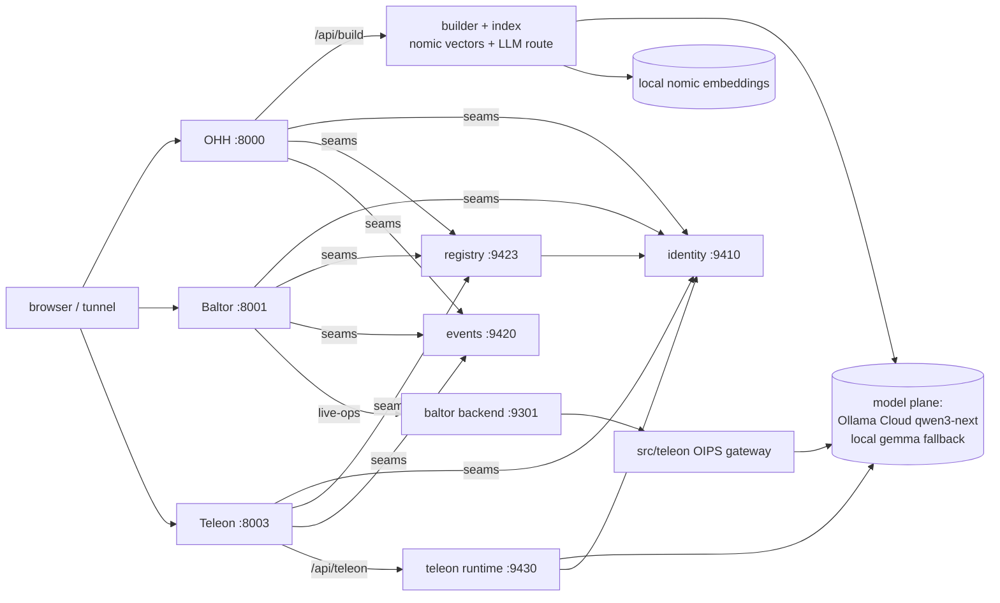

# Products deep dive — Baltor · Teleon · OpenHarnessHub and everything they touch

Date 2026-06-11. Owner-requested. Sources: three exhaustive dependency scouts (Baltor, Teleon,
OHH) reconciled against THIS SESSION'S live-verified state (the scouts read some pre-model-plane
docstrings; where they disagree with a live verification below, the live verification wins).

## 0. The shared service plane (every product rides these)

| Port | Service | Status | Consumed by |
|---|---|---|---|
| 8000–8003 | showcase app servers (OHH·Baltor·CIE·Teleon) + same-origin seam proxies | LIVE | browsers/tunnels |
| 9410 | identity realms (25 realms, disk-persisted, hash-only keys) | LIVE | every surface (sign-up, sessions, API keys) |
| 9423 | Open*Hub registry (catalogs for ALL hubs, workspace, review/promotion gate) | LIVE | all 21 hubs + products |
| 9420 | events/analytics plane (PII-guarded ingest) | LIVE | every surface (page beacons) |
| 9430 | Teleon capability runtime (MODEL-BUILT runs + receipts + promotion gate) | LIVE | Teleon app |
| 9301 | Baltor live-ops backend (event bus, pipeline, context gateway, OIPS projection) | LIVE | Baltor surfaces |
| 9210/9100s | design-bundle preview + portfolio statics | LIVE | tower links, hub prototypes |
| 9424/9426/9427 | MCP registry · receipt service · state service (HTTP planes) | PLANNED (held, reasons in registry) | — |
| — | model plane: chat = Ollama Cloud qwen3-next (~1s); embeddings = local nomic-768 (promotable) | LIVE | build/orchestration, narratives, Teleon runtime, OIPS |

Cloud-key state: Ollama Cloud key ACTIVE (primary). OpenRouter key staged in .env — needs
credits (completions 402). Flip = 3 lines in .env, zero code.

## 1. OpenHarnessHub (:8000)

Front-end `web/harness-hub` (full-design proto + `ohh-live.js` seam + legacy + admin-demo) →
`/api/build|export|components|primitives` (showcase backend: hybrid semantic search over the
2,5xx-component catalog + LLM orchestration via `scripts/model_routes` + cost/recipe/flowchart +
YAML governance cache) → registry/identity/events seams. The 21 hub sites render from ONE
makeHub engine consuming the same registry/identity per realm.

LIVE: semantic retrieval (nomic vectors), LLM selection + narrative (`llm_used:true`), live
catalog browse/detail with real governance fields, real tiers/canvas/alternatives/history/export
on the build path, accounts/workspaces/keys, A/B engine. DESIGNED (captioned): `/run` console
trace, billing/checkout, admin/foundry telemetry fixtures.

## 2. Teleon (:8003 + :9430)

Front-end `web/teleon` (kit-reference site + `teleon-live.js`) → runtime :9430 (4 capabilities;
"Build" EXECUTES: model mode = qwen3-next performs every example, ~12s; deterministic reference
impls remain the honest fallback; receipts per attempt; gate ≥0.90 promotes; restart-safe) →
identity validate (9410). Library spine `src/teleon/*` (purpose_tasks, agent_gateway, OIPS
inference + adapters [live-call capable], workers/fleet, experiments/parallel-paths, blackboard,
sandbox, ports) — consumed by Baltor through the versioned `TeleonClient` boundary; the
dependency law (Baltor→Teleon→OHH, never reverse) is proof-enforced.

LIVE: the full capability lifecycle (model-built, evidence-gated), keys/realm flows, A/B, ⌘K.
DESIGNED: PurposeTask Control Tower + Assurance Portal (prototypes; the greenfield TS build per
`prompts/teleon-build-kit.md` is the intended real version). PLANNED (held): blackboard/receipt/
MCP planes as HTTP services.

## 3. Baltor (:8001 + :9301)

Front-end `web/baltor` (full ce-* design + 25+ guided demos + legacy live-ops pages) → :9301
(8 projection handlers: context/consumption, inference [OIPS — now executes REAL models under
`OH_INFERENCE_ALLOW_NETWORK=1`, receipts carry model/latency/tokens, `is_truth:false` always],
pipeline, memory, native, standards, determinism, temporal graph; event bus with SSE+poll; fleet
projection; durable pipeline runtime behind `BALTOR_DURABLE_DB`; Redis-backed worker queue) +
the same identity/registry/events seams via :8001.

LIVE: run-full-pipeline (now includes a real `inference.completed` on `model.ollama_local`),
ConsumptionService served-facts + held-out warnings (proof-gated), context-gateway search/fetch
projections, dashboards on the real event bus, real realm sign-up on the product site.
DESIGNED/FIXTURE: guided-demo scenarios (OFAC/EUR-Lex offline snapshots labeled as such — eCFR
attempts live fetch first), standards/pattern registries (static projections), fleet workers
(projection of a skeleton).

## 4. Cross-system flow (one picture)

## 5. Consolidated risks (deduped from the scouts, corrected, prioritized)

1. **Model-plane regression can be silent** — if env is lost, embeddings fall back to hash and
   LLM to deterministic, honestly labeled but easy to miss. → build `check_model_plane` drift
   gate (health must report promotable embeddings + reachable route) and surface model-plane
   state on the Demo Control Tower. (Supersedes the OHH scout's "hash cliff" — hash is NOT
   currently active.)
2. **Designed-only routes can read as wired** (OHH `/run`, billing/checkout) → task #34 builds
   the real run executor; billing stays emulated by intent (captioned).
3. **Consumption tenant isolation unproven** — `run_cfpb_to_consumption` is single-corpus;
   add a tenant-aware proof before any multi-tenant claim.
4. **ctx:// handle resolution is fixture-grade** in the Baltor context gateway → wire fetch
   to the real corpus store with a consistency check.
5. **Events durability** — :9301 bus syncs from Redis without a local WAL → add JSONL
   write-ahead + startup reconciliation.
6. **Planned planes still held** (receipt/state/MCP as HTTP) — canonical libs exist in
   src/teleon; expose when a consumer needs them (don't build shelfware).
7. **Control Tower/Assurance Portal remain prototypes** — the greenfield TS build is the real
   version; the :9430 runtime is ready to back it.
8. **OpenRouter credits** — owner action; until then Ollama Cloud is primary and local gemma
   is the offline fallback.
9. **Dependency law is CI-proof, not runtime-enforced** — acceptable; revisit only if module
   loading ever becomes dynamic.
10. **Identity as single session authority** — registry/runtime fail closed when it's down
    (correct), so keep it in every health sweep (it already is).

## 6. Prioritized buildout list (next steps)

1. OHH `/api/run` real flow executor (task #34) — gates + ONE governed model call + checks,
   per-step trace; un-designs the last big simulation.
2. `check_model_plane` drift gate + tower model-plane status row (risk #1).
3. Tenant-isolation proof for ConsumptionService (risk #3).
4. ctx:// handle fetch consistency (risk #4).
5. Events WAL on :9301 (risk #5).
6. Greenfield Teleon TS dashboard against :9430 (the designed tower → real).
7. OpenRouter flip when credits land; consider fast-model for selection (ministral-3:8b) vs
   quality for narrative (qwen3-next) as per-call routing.
