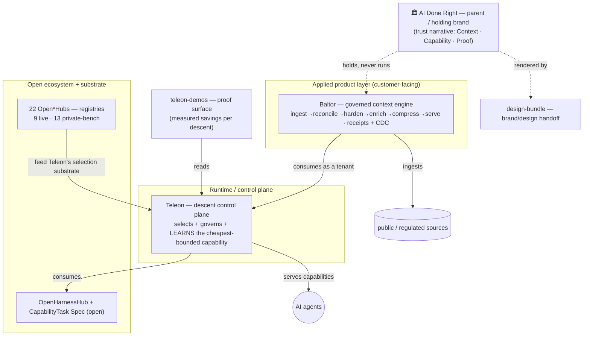

# Architecture map — the honest north star (generated by `scripts/build_architecture_map.py`)

> Generated from the canonical single sources (`portfolio_connection_map.json` + `surface_map.json` + the demo catalog + `docs/use-cases/`). Layers are derived from the enforced dependency law, so this can't drift. Visual version: `dist/architecture/index.html`. Honest labels: **live** vs **private-bench** vs **representative**.

## Layers (top → bottom)

1. **AI Done Right** — parent / holding brand (the *promise*, not a product; owns no runtime/customer data).
2. **Baltor** — the applied, customer-facing **governed context engine** (Verified · Current · Provable; the first live wedge = compliance / AML / sanctions). *Powered by Teleon.*
3. **Teleon** — the thin **control / metadata / orchestration plane** that descends each capability to the cheapest bounded path that still meets the requirement, receipt-backed. Serves AI agents + Baltor.
4. **OpenHarnessHub + the 22 Open\*Hubs** — the open ecosystem + the registries that feed Teleon's selection substrate. **Dependency law (enforced): Baltor → Teleon → OpenHarnessHub, never the reverse.**

### Open\*Hub roster (9 live · 13 private-bench = 22)
- **Live:** OpenContextHub, OpenSkillsHub, OpenToolsHub, OpenSkillToTool, OpenHarnessHub, OpenMCPHub, OpenCompressionHub, OpenBenchmarkHub, OpenReviewHub
- **Private-bench:** OpenTemplatesHub, OpenEndpointHub, OpenEnvHub, OpenSandboxHub, OpenAgentHub, OpenReceiptHub, OpenStateHub, OpenRoutingHub, OpenReconciliationHub, OpenHardeningHub, OpenEnrichmentHub, OpenOptimizationHub, OpenVerificationHub

## Surfaces

- **ai-done-right** [live] — The trust layer for AI — Context, Capability, Proof. The holding brand over a context product, a capability runtime, and an open ecosystem.
- **baltor** [live] — Governed context engine — Verified, Current, Provable context. 'Models don't fail. Their context does.' Ingest -> reconcile -> harden -> enr
- **teleon** [live] — Thin CONTROL / METADATA / orchestration plane (not a compute unit): selects + governs + LEARNS the cheapest-that-meets bounded version of a 
- **openharnesshub** [live] — The open ecosystem + the open CapabilityTask spec (CTS) — evals, harnesses, templates, skills. The community substrate the commercial layers
- **open-star-hubs** [mixed (9 live + 13 private)] — Each Open*Hub is a registry surface (models, context, compression, skills, tools, benchmarks, receipts, routing, verification, ...) that POP
- **teleon-demos** [live] — The proof surface — every descent demo with its MEASURED saving vs the expensive default (extraction 47-91%, enrichment 86%), governed (serv
- **design-bundle** [live] — The high-fidelity design/brand handoff bundle (24+ surfaces, 22 hubs) for Claude Code Max — the single source for the portfolio's UI.

## Product demos (10 in the catalog)
`doc_schema_extraction`, `search_enrichment`, `classification_routing`, `summarization_compression`, `pii_redaction`, `table_extraction`, `rerank_retrieval`, `sql_generation`, `translation`, `factcheck_verification`

## Use-cases (20)
`aml-screening`, `baltor-public-source-demo-catalog`, `cfpb-consumer-complaints-context-demo`, `clinical-decision-support`, `code-review`, `cost-aware-pipeline-generation`, `customer-support`, `deep-research`, `document-to-knowledge-graph`, `esg-supply-chain-due-diligence`, `human-trafficking-ugc-detection`, `illicit-content-detection`, `image-gen`, `llm-pipeline-saas-blueprint`, `llm-red-team`, `local-first-research-wiki`, `local-sentence-to-pipeline-demo`, `personal-llm-companion`, `qa-on-documents`, `refugee-bureaucracy-translation`

