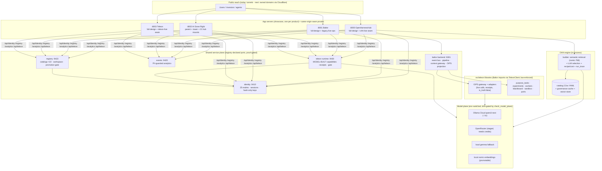

# Architecture · SWOT · Problem→Solution · Hosting — the full review

Date 2026-06-11 (owner-requested). Companion to `docs/status/products-deep-dive.md` (dependency
detail) and `docs/strategy/teleon-baltor-openharnesshub-portfolio.md` (the canonical law).
Everything below reflects the LIVE, verified state — not aspiration.

## 1. Architecture — how everything works (one diagram)

Provisioning flows: **customer** — per-realm sign-up → console `/keys` (shown-once, hash-only);
**owner** — `AIDR_REGISTRY_ADMINS` roster seam + (queued) `provision_access` CLI; **agents** —
minted API keys against the same realms (verify endpoint exists).

## 2. SWOT

**Portfolio**
- **S**: evidence-gated honesty is implemented, not claimed (receipts, promotion gates, held-out
  warnings, "unproven" states); one design system across 28 surfaces; provider-neutral model
  plane (cloud↔local is a 3-line .env change); 390+ proof checks; everything filmed.
- **W**: single-operator bus factor; demo-grade persistence (JSONL/PVC, Postgres path unproven
  under load); lift numbers still "unproven" (eval harness not yet measuring real tasks);
  designed surfaces remain (billing, Teleon tower); no paying users yet.
- **O**: Airbyte just educated the market that "context layer for agents" matters — we sell the
  layer ABOVE theirs (assurance); CodeStrap validates determinism-as-product; regulated-facts
  beachhead (sanctions/CFPB demos already real); agents-as-customers (keys/receipts built).
- **T**: Airbyte's distribution could absorb "good enough" context; data-gravity platforms
  (Snowflake/Databricks/DeepMind-Contextual) bundling; LLM vendors shipping built-in
  verification; our words ("context layer", "underwrite") being claimed in others' ads.

**Baltor** — S: only player with a verification RAIL + lossless held-out honesty; live pipeline
+ receipts demoable today. W: guided demos are fixtures (labeled); tenant isolation unproven.
O: compliance buyers need provable currency (OFAC staleness demo IS the pitch). T: Anthropic
financial-services + Airbyte context store eating the "good enough" end.

**Teleon** — S: model-builds, evidence-judges, self-refines — on film; receipts per attempt;
agent gateway + key plane real. W: tower/portal designed; deep runtime (PurposeTask TS build)
pending. O: CodeStrap/X-Reason proves enterprises buy "AI you can underwrite" — we underwrite
with EVIDENCE, not just state machines. T: Temporal/DBOS adding eval-ish layers.

**OpenHarnessHub** — S: 2,5xx-component live registry + describe→build→RUN funnel fully real;
21-hub network effect surface; open spec (CTS). W: lift "unproven" until evals run; community
=0 today. O: the open funnel feeding both products; agents installing components by API.
T: HuggingFace/MCP directories as default discovery.

## 3. Problem → Solution (per paid package / surface / tool)

| Offering | Problem (real) | Our solution (live today) | Gap to close |
|---|---|---|---|
| **Baltor CEaaS** (paid) | Agents act on stale/conflicting/unprovable facts | Verified+Current+Provable serving: pipeline w/ verification rail, receipts, held-out warnings, revocation | tenant isolation proof; live feeds beyond eCFR; pricing page → real billing |
| **Baltor Context Gateway / MCP** | Agents over-fetch and trust raw context | Bounded packs + source handles + deferred fetch; glossary/dimensions/rerank | ctx:// handle consistency; cloud MCP exposure |
| **Teleon runtime** (paid) | Agent capability quality is vibes, not evidence | Model-built capabilities gated by REAL example suites; receipts/version/rollback | TS control tower; broader capability templates; metering→billing |
| **Teleon agent gateway** | Agents burn tokens re-deriving stable capabilities | Deterministic-first token ladder; receipt-backed calls; per-realm keys | publish as cloud endpoint + SDK |
| **OHH builder** (free funnel) | Pipeline assembly is artisanal | describe→build (LLM-selected, semantically retrieved)→run (REAL trace)→export (open spec) | measured lift on cards; community publish flow promo |
| **OHH registry + 21 hubs** | Component trust is unverifiable | Promotion gate, review queue, provenance fields from catalog, signed-* roadmap | real signing (Rekor) per BACKEND-STACK; bench hubs flip-to-live criteria |
| **Identity/keys plane** | Per-product auth sprawl | One kit, 25 isolated realms, shown-once hash-only keys, audited | OAuth seams (owner-gated) when real users arrive |
| **Inference gateway (OIPS)** | Provider lock-in + unprovable model usage | Numeric provider graph, adapters, receipts w/ is_truth:false | per-node secrets (api_key_env) + cloud nodes config |

## 4. Competitors (matrix is memory-backed; details in memory files)

| Player | Their claim | Our counter |
|---|---|---|
| **Airbyte** | "Context layer for AI agents" (Context Store, MCP, 600+ connectors) | They MOVE context; we make it SAFE TO ACT ON (verify/reconcile/gate/receipt). Wrap them as ingestion candidate. |
| **CodeStrap X-Reason** | Underwritable orchestration (NL→XState) | They orchestrate work; we govern claims + evidence-gate capability itself. Adapter candidate. |
| Supermemory / memory players | Agent memory | Memory ≠ assurance; wrap behind ports. |
| Snowflake/Databricks/DeepMind-Contextual | Data-gravity context | Neutral overlay + receipts portability is the counter. |
| Temporal/DBOS | Durable execution | Runtime substrate candidates, never the trust plane. |

Positioning actions queued: Baltor pages adopt assurance-vs-movement contrast (owner copy
approval required — design contract).

## 5. Modularization review (honest)

**Genuinely modular:** the two model resolvers (every consumer shares them); OIPS adapter
registry (one base class, styles by config); realm-parameterized services (25 realms, zero
per-realm code); the seam-proxy table (registry-driven ports); makeHub (21 sites from one
engine); the port-script PATCHES discipline (all divergence recorded + drift-gated); per-app
kit copies byte-checked against one source.
**Watch items:** `baltor_admin_demo_server.py` is a 5.7k-line monolith (handlers are extracted,
the dispatcher isn't) — split when it next grows; ohh-live/teleon-live duplicate the
honest-fallback boilerplate (fine at 2, extract at 3); legacy + full-design coexistence doubles
some surfaces (intentional, lossless — revisit after launch); events-service self-test port
collision (needs --port arg).

## 6. Outdated context corrected in this review

- "Design rollout to web/ still queued" → DONE (4 apps live on the full design) — memory updated.
- Scout claims fixed earlier (hash embeddings active / seams missing) — see deep-dive addenda.
- `web/README` says no-build "vanilla" in places — superseded by the transplant section (kept).
- OpenRouter "ready" → key VALID but ZERO CREDITS (owner action).

## 7. Hosting recommendation (cheap · single provider · co-located)

Need: ~10 lightweight long-running Python services + 4 static-ish fronts + Postgres + Redis,
all same-region/same-network; GPU NOT required (model plane is API-based; local gemma optional).

| Option | Co-location | Realistic cost | Fit |
|---|---|---|---|
| **Hetzner 1 box (CPX31/CAX31) + k3s + Cloudflare in front** | same HOST (sub-ms) | **€8–15/mo** | ✅ RECOMMENDED — our k8s manifests run on k3s unchanged; Cloudflare tunnel/DNS plan already written; scales by adding a node |
| Fly.io | private 6PN, same region | ~$15–30/mo realistic | good managed fallback; volumes for state |
| Render | same-region private net | ~$7/service ⇒ $70+/mo at our service count | your instinct is right — priciest of the three for our shape |
| GCP/AWS/Azure (Cloud Run/EKS…) | same region | most $$ + most ops | only when scale/GPU/compliance demands |

Verdict: **one Hetzner box + k3s + Cloudflare** meets "cheap, single provider, everything
side-by-side" exactly; Fly.io if you prefer fully managed. Keys needed from you either way:
Cloudflare token + nameserver flips; then Hetzner API token (or Fly token + card).

## 8. Owner decisions requested

1. Hosting pick (Hetzner-k3s recommended) + Cloudflare token + NS flips.
2. OpenRouter credits (optional speed).
3. Copy approval for the Airbyte-contrast positioning lines.
4. Which lift-eval harness tasks to measure first (turns "unproven" into numbers).
